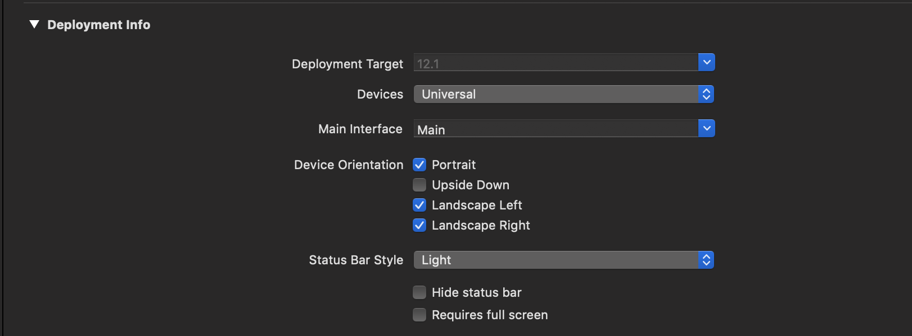
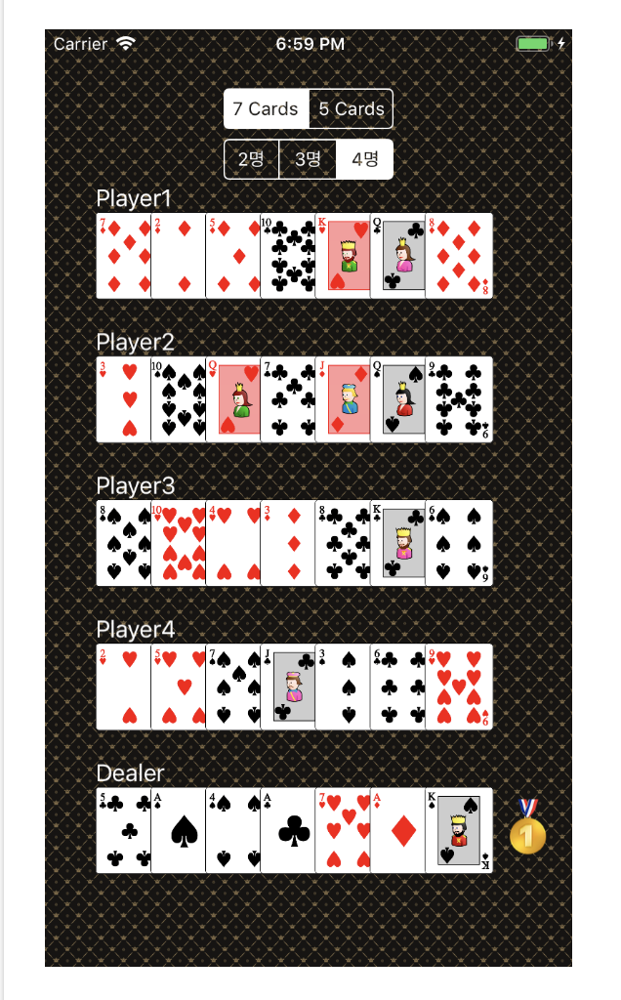
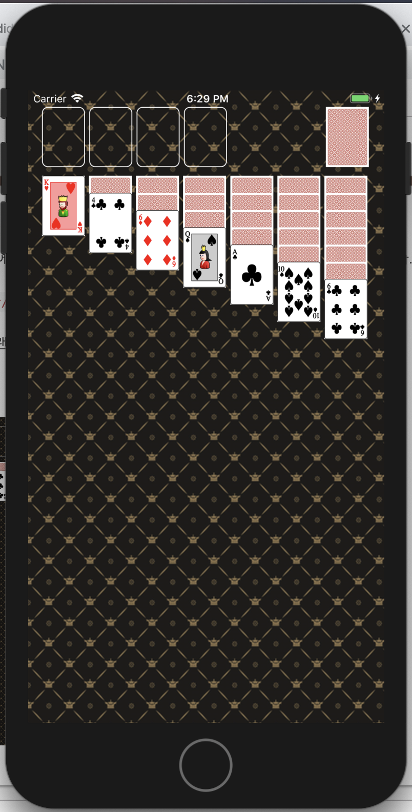
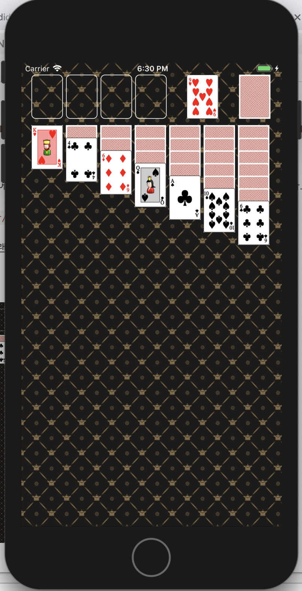
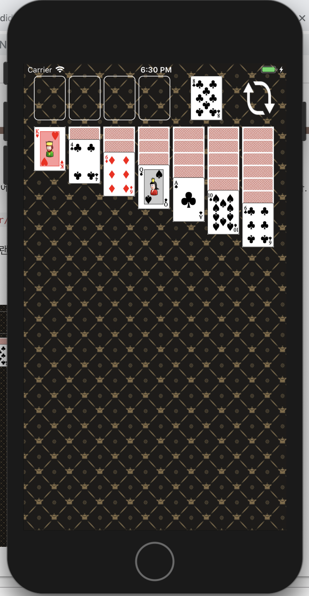

## CardGameApp


### Step1



 이전 단계 포커게임 앱에서 만들었던 것과 거의 동일하게 작성하였다.


**BackGround Pattern 지정해주기**

```swift
class ViewController: UIViewController {
    override func viewDidLoad() {
        self.view.backgroundColor = UIColor.init(patternImage: UIImage(named: "bg_pattern")!)
    }
}
```


**실행화면**


### Step 2



* 이번 단계에서는 `CustomView`를 만들어서 작성하였다.


**UIStackView**

 `UIStackView`란 여러 개의 뷰들을 하나의 세트로 만들어 주는 역할을 해준다. 그렇담 이 세트로 만들어 어떻게 사용하느냐하면 보통 View들을 레이아웃을 잡아줄 때 편리하게 사용할 수 있다. 이 뷰들을 **4가지 Attribute** 들을 사용하여 정렬할 수 있다.

1. Axis : StackView의 정렬할 큰 형태를 정할수 있다. 크게 `.Horizontal` `.Vertical`이 있다.
2. Alignment : StackView안의 view들의 Y축 정렬을 설정할 수 있다.
3. Distribution : StackView안의 view들의 X축 정렬을 설정할 수 있다.
4. Spacing : StackView안의 view들의 간격을 설정할 수 있다.


이번 단계에서는 카드 스택들의 레이아웃을 잡아줄 때 `Custom View` 를 만들어 `UIStackView`를 사용하였다.

```swift
class CardStacksView: UIStackView {
    required init(coder: NSCoder) {
        super.init(coder: coder)
        initialSetting()
    }
    
    override init(frame: CGRect) {
        super.init(frame: frame)
        initialSetting()
    }
    
    private func initialSetting() {
        self.spacing = 5
        self.axis = .horizontal
        self.distribution = .fillEqually
    }
    
    // StackView에 View를 추가할 때
    func addView() {
        self.addArragedSubView(UIview:) // UIView 레퍼런스 타입의 뷰 추가 가능
    }
}

// UIStackView에서는 var arragedSubview :[UIView] 로 뷰들을 관리
```


**실행화면**

1. 초기 화면



2. Deck을 터치하였을 시



3. Deck에 카드가 없을 시

