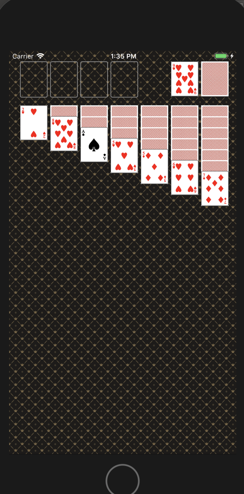

# 카드게임

## 16-1

- 요구사항대로 화면 구성
- 기존에 getImageFileName 메소드를 통해 이미지 파일명을 물어오던 방식에서 card 까지 클로저를 내려보내서 카드 이미지를 출력하도록 방식 개선

## 16-2

CardStackView 구현
- stack 형태로 카드를 출력하고 가장 아래 카드만 앞면으로 보이도록 구성

CardDeckView 구현
- 뒤집어져있는 카드덱 클릭 시 뒤집어져서 왼쪽에 카드 앞면으로 보이도록 구성
- 카드 덱에 있는 모든 카드를 뒤집으면 refresh 이미지 출력
