# 카드게임 앱

## Step1 (카드게임판 시작하기)
### 요구사항
- iOS 프로젝트 Single View App 템플릿으로 하고 프로젝트 이름을 "CardGameApp"으로 지정하고, 위에 만든 로컬 저장소 경로에 생성한다.
- 기본 상태로 아이폰 8 Plus 시뮬레이터를 골라서 실행한다.
- readme.md 파일을 자신의 프로젝트에 대한 설명으로 변경한다.
    - 단계별로 미션을 해결하고 리뷰를 받고나면 readme.md 파일에 주요 작업 내용(바뀐 화면 이미지, 핵심 기능 설명)과 완성 날짜시간을 기록한다.
    - 실행한 화면을 캡처해서 readme.md 파일에 포함한다.

### 프로그래밍 요구사항
- 앱 기본 설정을 지정해서 StatusBar 스타일을 LightContent로 보이도록 한다.
- ViewController 클래스에서 self.view 배경을 이미지 패턴으로 지정한다. 이미지 파일은 Assets에 추가한다.
- 카드 뒷면 이미지를 다운로드해서 프로젝트 Assets.xcassets에 추가한다.
- ViewController 클래스에서 코드로 아래 출력 화면처럼 화면을 균등하게 7등분해서 7개 UIImageView를 추가하고 카드 뒷면을 보여준다.
- 카드 가로와 세로 비율은 1:1.27로 지정한다.

### 결과
#### UI
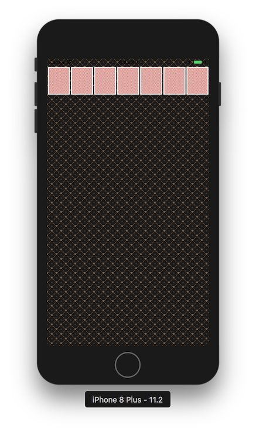

---
## Step2 (카드 UI)
### 요구사항
- 카드게임판 시작하기 요구사항을 구현한 상태에서 시작한다.
- iOS 앱 프로젝트 기본 구조인 MVC 형태에 맞춰서 기존 레벨2에서 작성한 카드게임 소스 파일을 적용한다.
- 화면을 개선하고 카드 이미지를 적용한 UI를 완성한다.
- readme.md 파일을 자신의 프로젝트에 대한 설명으로 변경한다.
    - 단계별로 미션을 해결하고 리뷰를 받고나면 readme.md 파일에 주요 작업 내용(바뀐 화면 이미지, 핵심 기능 설명)과 완성 날짜시간을 기록한다.
    - 실행한 화면을 캡처해서 readme.md 파일에 포함한다.

### 프로그래밍 요구사항
- 레벨2 CardGame 미션의 Main, InputView, OutputView를 제외하고 전체 클래스를 프로젝트로 복사한다.
- 기존 코드들은 MVC 중에서 대부분 Model의 역할을 담당한다.
- 카드 이미지를 다운로드 받아서 Assets에 추가한다. 파일이름을 바꾸지말고 그대로 활용한다.
- Card 객체에 파일명을 매치해서 해당 카드 이미지를 return 하는 메소드를 추가한다.
- Card 객체가 앞면, 뒷면을 처리할 수 있도록 개선한다.
- CardDeck 인스턴스를 만들고 랜덤으로 카드를 섞고 출력 화면처럼 보이도록 개선한다.
- 화면 위쪽에 빈 공간을 표시하는 UIView를 4개 추가하고, 우측 상단에 UIImageView를 추가한다.
    - 상단 화면 요소의 y 좌표는 20pt를 기준으로 한다.
    - 7장의 카드 이미지 y 좌표는 100pt를 기준으로 한다.
- 앱에서 Shake 이벤트를 발생하면 랜덤 카드를 다시 섞고 다시 그리도록 구현한다.

### 결과
#### UI
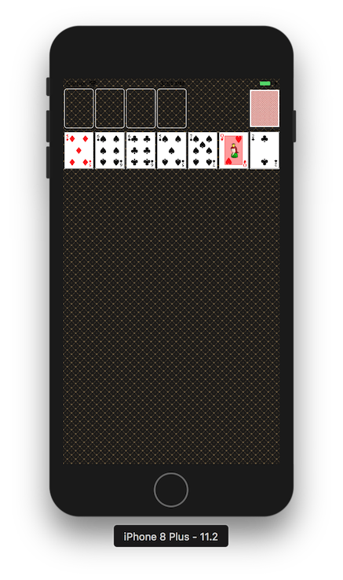

---
## Step3 (카드스택 화면 표시)
### 요구사항
- 카드 UI 요구사항을 구현한 상태에서 시작한다.
- 화면을 개선하고 카드 앞,뒤 이미지를 모두 출력할 수 있도록 개선한다.
- 화면에 카드스택을 표시할 수 있도록 개선한다.
- readme.md 파일을 자신의 프로젝트에 대한 설명으로 변경한다.
    - 단계별로 미션을 해결하고 리뷰를 받고나면 readme.md 파일에 주요 작업 내용(바뀐 화면 이미지, 핵심 기능 설명)과 완성 날짜시간을 기록한다.
    - 실행한 화면을 캡처해서 readme.md 파일에 포함한다.

### 프로그래밍 요구사항
- CardDeck 객체에서 랜덤으로 카드를 섞고, 출력 화면처럼 카드스택 형태로 보이도록 개선한다.
    - 카드스택을 관리하는 모델 객체를 설계한다.
    - 각 스택의 맨위의 카드만 앞카드로 뒤집는다.
- 카드스택에 표시한 카드를 제외하고 남은 카드를 우측 상단에 뒤집힌 상태로 쌓아놓는다.
- 맨위에 있는 카드를 터치하면 좌측에 카드 앞면을 표시하고, 다음 카드 뒷면을 표시한다.
- 만약 남은 카드가 없는 경우는 우측에도 빈 카드를 대신해서 반복할 수 있다는 이미지(refresh)를 표시한다.
- 앱에서 Shake 이벤트를 발생하면 랜덤 카드를 다시 섞고 처음 상태로 다시 그리도록 구현한다.

### 결과
#### UI
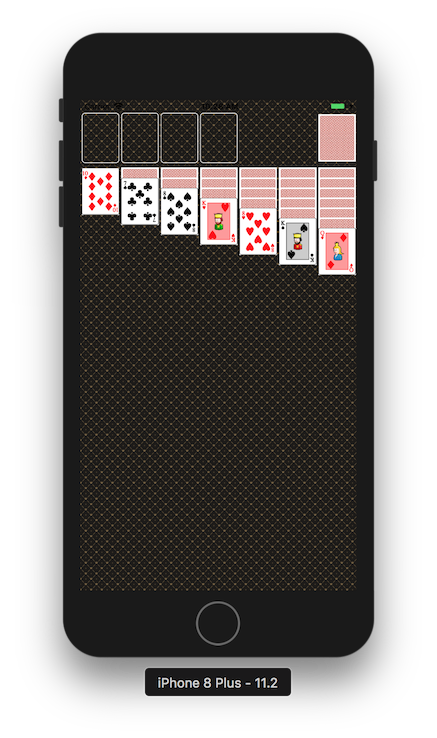
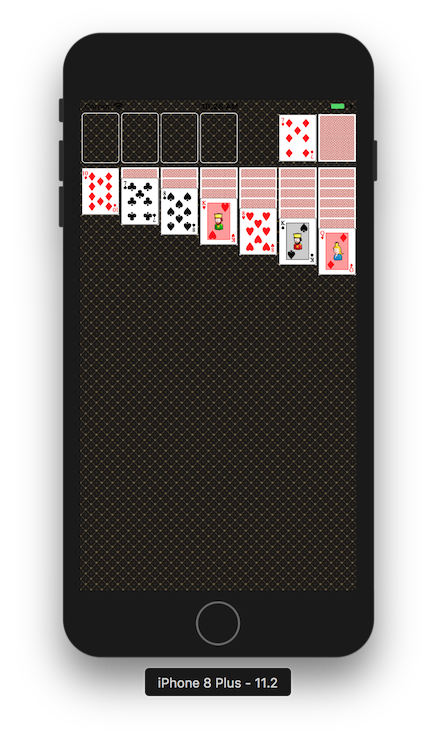
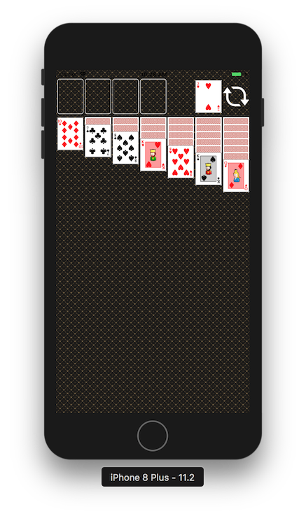

---
## Step4 (제스처 인식과 게임 동작)
### 요구사항
- 카드를 표시하는 UIImageView에서 더블탭 이벤트를 처리할 수 있도록 개선한다.
    + 더블탭을 누른 경우, 조건을 판단해서 좌측 상단으로 카드 이미지를 이동한다.
- readme.md 파일을 자신의 프로젝트에 대한 설명으로 변경한다.
    + 단계별로 미션을 해결하고 리뷰를 받고나면 readme.md 파일에 주요 작업 내용(바뀐 화면 이미지, 핵심 기능 설명)과 완성 날짜시간을 기록한다.
    + 실행한 화면을 캡처해서 readme.md 파일에 포함한다.

### 프로그래밍 요구사항
- 이벤트 처리하는 객체와 애니메이션을 담당하는 객체 역할을 구분해서 설계한다.
- 좌측 상단 카드묶음과 스택 카드묶음을 담당할 객체를 구현한다.
- 카드마다 UIImageView에서 더블탭 이벤트를 처리하도록 제스처 인식기를 연결한다.
    + 더블탭은 앞면으로 뒤집혀 있는 카드만 처리한다. 뒷면인 카드는 무시한다.
    + 만약 A카드인 경우 왼쪽 상단의 비어있는 칸으로 UIImageView를 animate 시킨다.
        - 기존에 다른 A카드가 있으면 그 옆으로 이동한다.
    + K카드인 경우 스택 중에서 좌측부터 빈 칸이 있으면 빈 칸으로 이동시킨다.
    + 나머지 2이상 카드인 경우 왼쪽 상단에 같은 모양의 A가 있는 경우는 그 위로 이동시킨다.
    + 상단으로 이동할 수 없는 경우, 스택 중에서 좌측부터 앞면으로 된 카드 중 가장 위에 있는 카드와 다음 조건을 확인하고 조건에 맞으면 그 위로 이동시킨다.
        - 숫자가 하나 큰 카드가 있는지 확인한다. ex) 터치한 카드가 2인 경우 3, 10인 경우 J
        - 모양의 색이 다른지 확인한다. ex) 터치한 카드가 ♠️♣️ 이면 ♥️♦️
- 스택에서 마지막 카드가 다른 곳으로 이동한 경우 다시 마지막 카드를 앞면으로 뒤집는다
- 앱에서 Shake 이벤트를 발생하면 랜덤 카드를 다시 섞고 처음 상태로 다시 그리도록 구현한다.

### 결과
#### UI
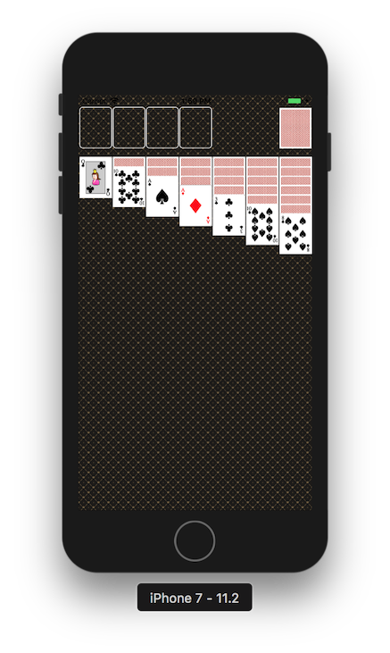
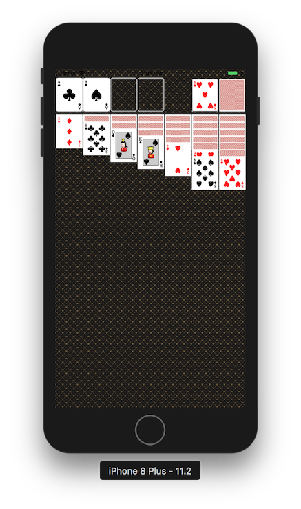

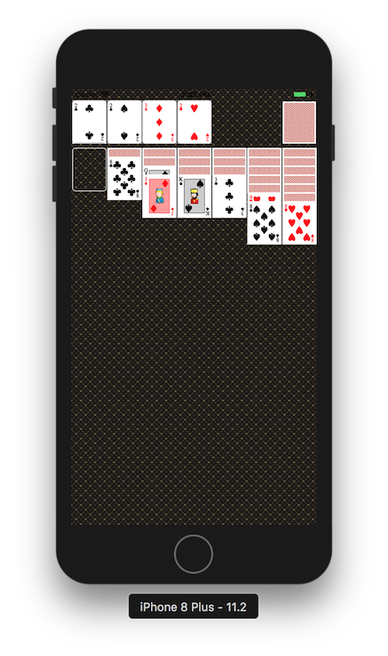
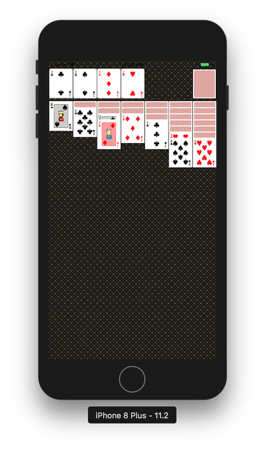
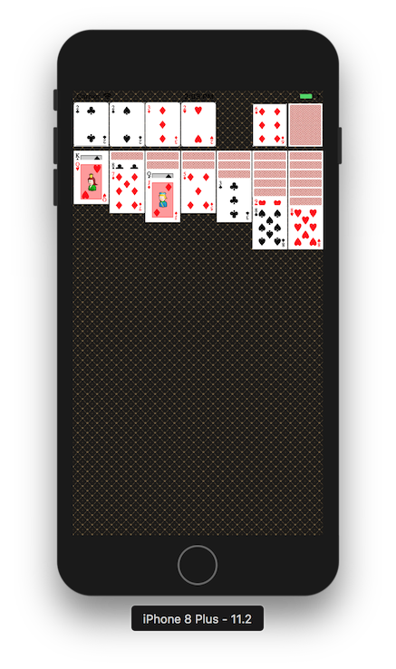
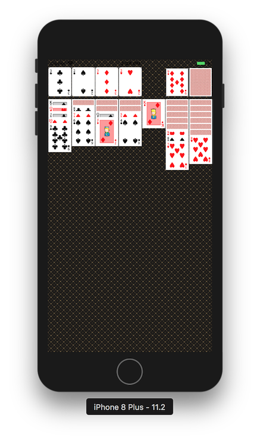
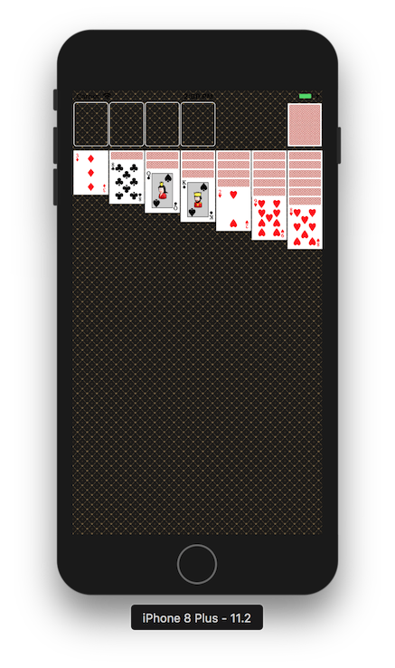

### 피드백
- 뷰모델이 공통으로 사용할 프로토콜은 없나?
- 이벤트를 처리를 각 카드이미지 객체가 하는게 좋을까? ViewController가 하는게 좋을까?
- ViewController - ViewModel 역할 분담은 어떻게 나누는게 좋을까?

---
## Step5 (드래그 앤 드롭)
### 요구사항
- 앞으로 뒤집힌 카드 묶음을 드래그 앤 드롭할 수 있도록 개선한다.
- 앱 아이콘 디자인 파일로 필요한 아이콘 사이즈별로 만들어서 프로젝트에 추가한다.
- readme.md 파일을 자신의 프로젝트에 대한 설명으로 변경한다.
    - 단계별로 미션을 해결하고 리뷰를 받고나면 readme.md 파일에 주요 작업 내용(바뀐 화면 이미지, 핵심 기능 설명)과 완성 날짜시간을 기록한다.
    - 실행한 화면을 캡처해서 readme.md 파일에 포함한다.

### 프로그래밍 요구사항
- ViewController에서 터치 이벤트를 처리하도록 이벤트 핸들러를 추가한다.
    - 터치가 시작하면 누른 위치에 있는 카드를 찾고, 앞면으로 뒤집혀 있는 카드만 처리한다. 뒷면인 카드는 무시한다.
    - 터치가 움직이면 터치 시작 위치와 차이만큼 누른 위치 카드를 이동시킨다.
        - 만약 터치한 카드 아래에 다른 카드가 쌓여있는 경우는 함께 드래그 한다.
    - 터치를 놓았을 때 위치에 따라서 함께 드래그 하는 카드 묶음을 조건을 비교해서 이동시킨다.
        - 터치한 카드가 K인 경우는 스택 공간 중에 빈 칸으로 이동가능하다.
        - 나머지 카드인 경우 가장 위에 있는 카드와 다음 조건을 확인하고 조건에 맞으면 그 위로 이동시킨다.
        - 숫자가 하나 큰 카드가 있는지 확인한다. ex) 터치한 카드가 2인 경우 3, 10인 경우 J
        - 모양의 색이 다른지 확인한다. ex) 터치한 카드가 ♠️♣️ 이면 ♥️♦️
    - 우측 위쪽의 카드로 마찬가지 규칙에 맞춰서 카드를 이동시킨다.
- 스택에서 마지막 카드가 다른 곳으로 이동한 경우 다시 마지막 카드를 앞면으로 뒤집는다
- 앱에서 Shake 이벤트를 발생하면 랜덤 카드를 다시 섞고 처음 상태로 다시 그리도록 구현한다.
- 모든 카드가 좌측 상단에 순서대로 쌓인 경우는 축하메시지를 출력한다.

### 결과
#### UI
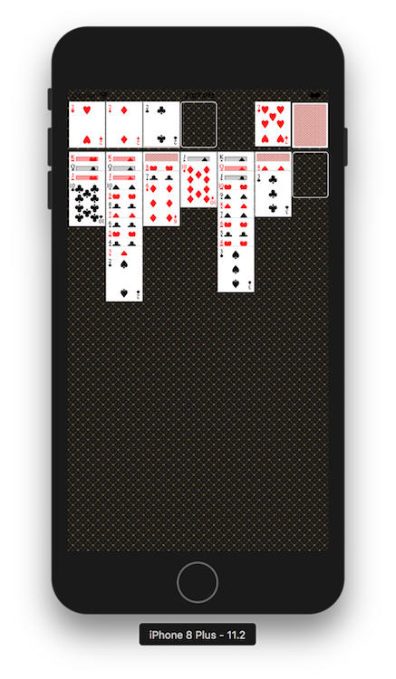
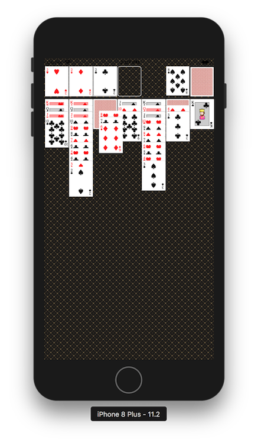
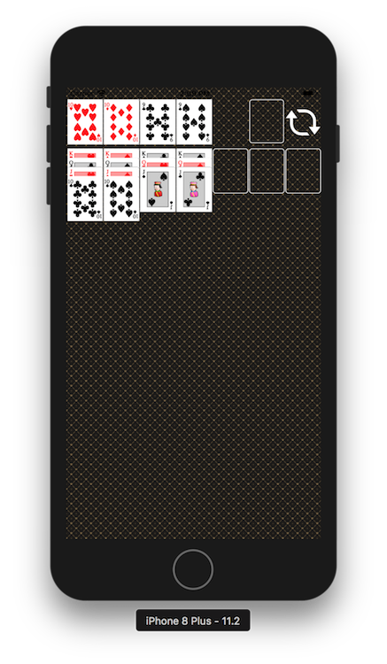
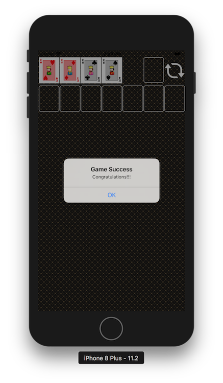

---
## 중간에 고생했던 부분 / 기억할 부분 간단 정리
- NotificationCenter를 설정할때 초기 설정부터 전달을 하려면 viewDidLoad에서 인스턴스가 생성되는 시점 전에 Observer를 등록해줘야 한다.
- 이미지뷰에 이미지를 추가할때 기존 뷰의 frame 사이즈가 없다면 이미지가 있어도 보이지 않는다.
- 자신을 다시 그리기 위해선 setNeedsDisplay(), subview를 다시 그리고 싶을땐 ,setNeedsLayout()
- superview의 사이즈를 subview가 넘어갈 경우에 화면상으로 보이지만 실제로는 존재하지 않는 것 처럼 동작한다(제스처인식 등이 불가)
- 애니메이션을 적용할때 실제로 animation이나 completion에 들어가는 클로저는 즉시 실행되지만 화면에서 처리되는건 duration과 delay에 영향을 받는다.
- TapGesture에서 numberOfTapsRequired로 탭의 횟수를 지정할 수 있다.
- 뷰의 제스처를 동작시키기 위해선 isUserInteractionEnabled 가 true 상태여야만 한다.
- 애니메이션에서 클로져를 사용할때 self를 사용한다면 꼭 self를 캡쳐해서 사용해서 weak한 상태로 만들어줘야한다.
  그렇지 않으면 클로져와 ViewController가 서로 순환참조를 하기 때문에 둘다 메모리에서 사라지지 못하는 현상이 생긴다.
- View에서는 알아서 UI가 그려진다고 가정하고 ViewModel을 이용해 테스트를 하면 원하는대로 동작한다고 확신할 수 있어야한다.
  따라서 ViewModel 유닛테스트를 통해 UI를 검증할 수 있도록 구현해야한다.
  이 것이 가능하려면 ViewModel과 View가 1:1매칭이 될 수 있도록 하는 것이 실수를 줄여준다.
- UIPanGesture와 Drag&Drop의 차이
    - UIPanGesture : 스크린 내에서 각각의 뷰들을 드래그 할때 사용
    - Drag&Drop: 특정 요소를 Editable한 요소로 이동시켜 포함시키는것
    - [StackOverflow질문에 대한 답변](https://stackoverflow.com/questions/49247723/which-one-is-better-uipangesture-or-uidraginteraction-uidropinteraction)
        - UIDragInteraction works from iOS 11.0+ & UIPanGestureRecognizer works from iOS 3.2+, so if you want to run your application in older version devices then you should use UIPanGestureRecognizer
        - UIPanGestureRecognizer works on the whole screen & gives you the CGPoints as response of touch where UIDragInteraction works on the particular object you want to drag & drop & gives you direct the view object.
        - UIPanGestureRecognizer can work with multiple touches & handle those where UIDragInteraction doesn't allow you to handle multiple touch.
- Responder Chain
    - iOS에서 이벤트 핸들링은 Responder라는 객체에 의해 다뤄진다. Responder 객체는 일반적으로 우리가 사용하는 UIView, UIViewController, 심지어 UIApplication 조차 상속하고 있다.
    - UIKit은 이벤트가 발생했을때 Responder객체들에게 알려서 이벤트를 처리하도록 돕는데 이때 사용되는 개념이 Responder Chain이다.
    - 아래 그림은 일반적인 Responder Chain을 설명해주고 있다.
        - 
        - UIKit에서 특별한 조건을 주지 않는 한 Responder Chain의 순서대로 하나씩 찾아가면서 이벤트를 처리하도록 한다고 생각하면 된다.
    - 만약에 view에 Gesture가 설정되어 있다면 view에서 인지하기 전에 GestureRecognizer가 먼저 이벤트를 검사하고 아무것도 처리되지 않는다면 그 때 view에게 지휘권이 넘어간다.
    - next 를 override 하면 Responder Chain순서를 변경 가능하다.
