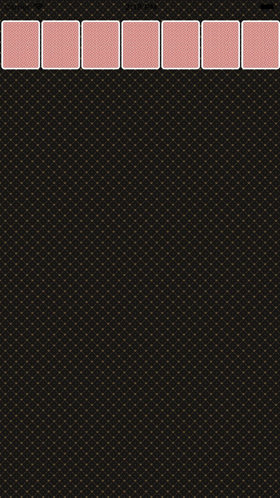
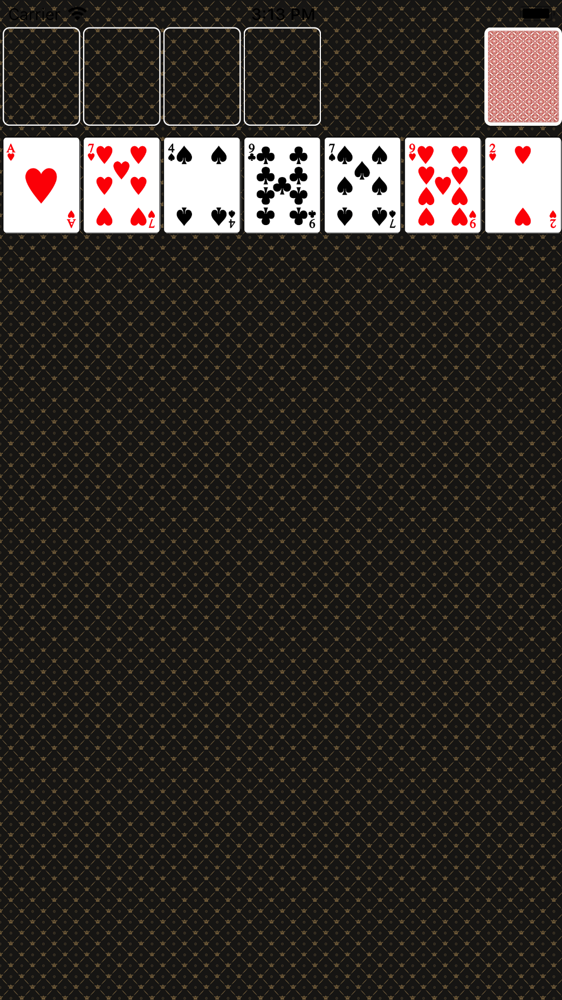
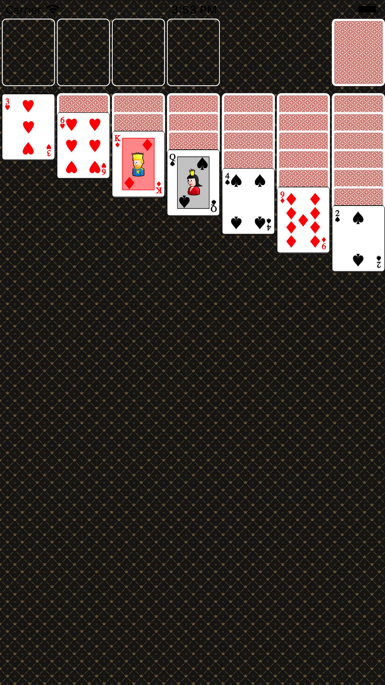
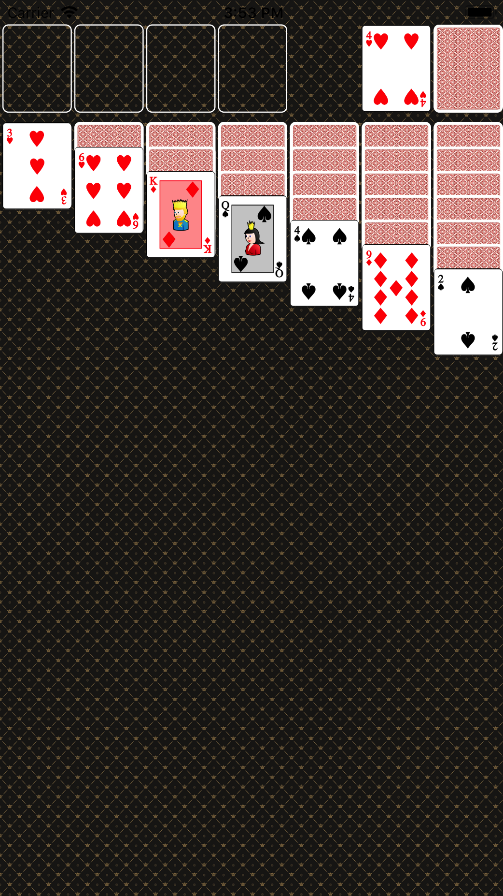
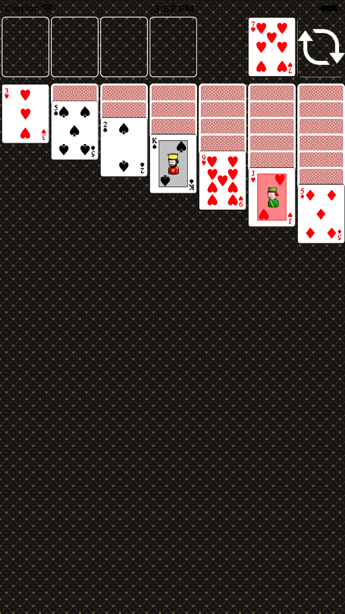
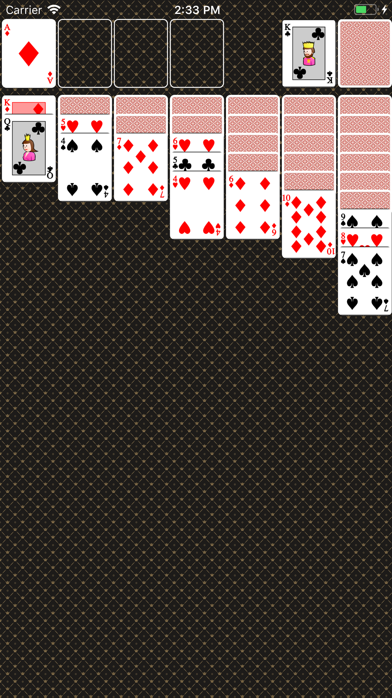
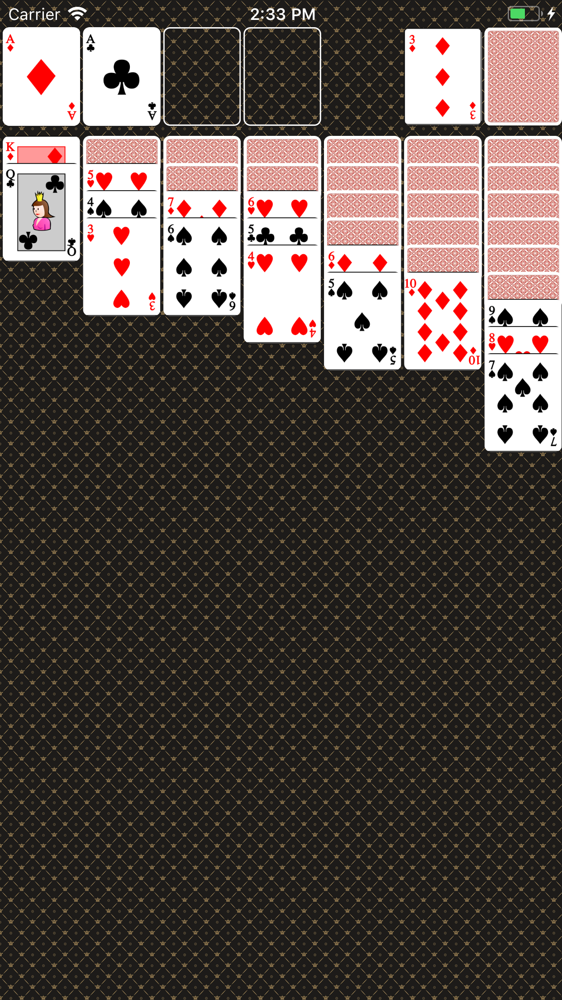
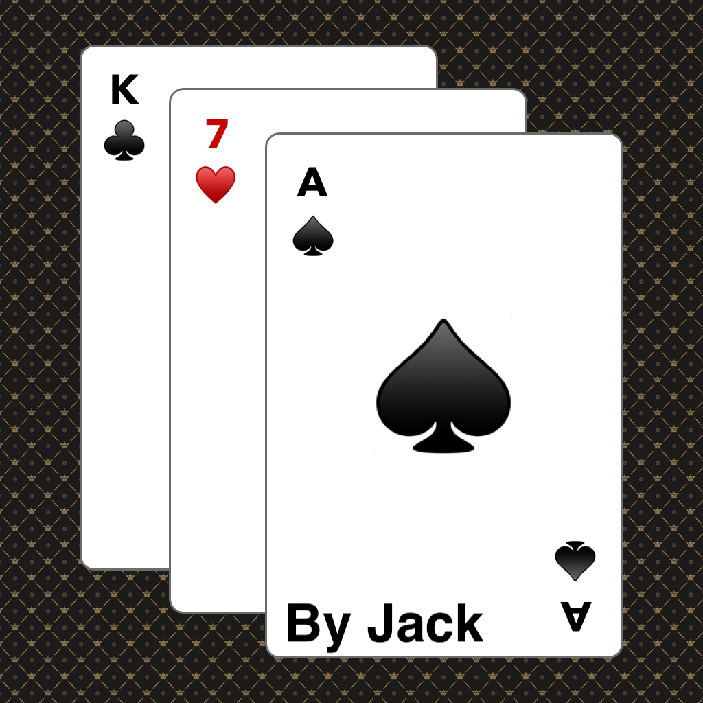
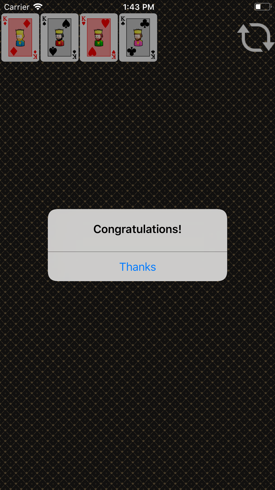

# - Step1 (카드게임판 구현하기)

## 요구사항
- ViewController 클래스에서 self.view 배경을 다음 이미지 패턴으로 지정한다. 이미지 파일은 Assets에 추가한다.	- ViewController 클래스에서 코드로 아래 출력 화면처럼 화면을 균등하게 7등분해서 7개 UIImageView를 추가하고 카드 뒷면을 보여준다.
- 카드 가로와 세로 비율은 1:1.27로 지정한다.

## 실행화면

# - Step2 (카드 UI)
## 요구사항
- Card 객체에 파일명을 매치해서 해당 카드 이미지를 return 하는 메소드를 추가한다.
- Card 객체가 앞면, 뒷면을 처리할 수 있도록 개선한다.
- CardDeck 인스턴스를 만들고 랜덤으로 카드를 섞고 출력 화면처럼 보이도록 개선한다.
- 화면 위쪽에 빈 공간을 표시하는 UIView를 4개 추가하고, 우측 상단에 UIImageView를 추가한다.
  - 상단 화면 요소의 y 좌표는 20pt를 기준으로 한다.
  - 7장의 카드 이미지 y 좌표는 100pt를 기준으로 한다.
- 앱에서 Shake 이벤트를 발생하면 랜덤 카드를 다시 섞고 다시 그리도록 구현한다.

## 실행화면

# - Step3 (카드스택 화면 표시)
## 요구사항
- CardDeck 객체에서 랜덤으로 카드를 섞고, 출력 화면처럼 카드스택 형태로 보이도록 개선한다.
  - 카드스택을 관리하는 모델 객체를 설계한다.
  - 각 스택의 맨위의 카드만 앞카드로 뒤집는다.
- 카드스택에 표시한 카드를 제외하고 남은 카드를 우측 상단에 뒤집힌 상태로 쌓아놓는다.
- 맨위에 있는 카드를 터치하면 좌측에 카드 앞면을 표시하고, 다음 카드 뒷면을 표시한다.
- 만약 남은 카드가 없는 경우는 우측에도 빈 카드를 대신해서 반복할 수 있다는 이미지(refresh)를 표시한다.

## 실행화면

# - Step4 (제스처 인식과 게임 동작)
## 요구사항
- 이벤트 처리하는 객체와 애니메이션을 담당하는 객체 역할을 구분해서 설계한다.
- 좌측 상단 카드묶음과 스택 카드묶음을 담당할 객체를 구현한다.
- 카드마다 UIImageView에서 더블탭 이벤트를 처리하도록 제스처 인식기를 연결한다.
  - 더블탭은 앞면으로 뒤집혀 있는 카드만 처리한다. 뒷면인 카드는 무시한다.
  - 만약 A카드인 경우 왼쪽 상단의 비어있는 칸으로 UIImageView를 animate 시킨다.
    - 기존에 다른 A카드가 있으면 그 옆으로 이동한다.
  - K카드인 경우 스택 중에서 좌측부터 빈 칸이 있으면 빈 칸으로 이동시킨다.
  - 나머지 2이상 카드인 경우 왼쪽 상단에 같은 모양의 A가 있는 경우는 그 위로 이동시킨다.
  - 상단으로 이동할 수 없는 경우, 스택 중에서 좌측부터 앞면으로 된 카드 중 가장 위에 있는 카드와 다음 조건을 확인하고 조건에 맞으면 그 위로 이동시킨다.
    - 숫자가 하나 큰 카드가 있는지 확인한다. ex) 터치한 카드가 2인 경우 3, 10인 경우 J
    - 모양의 색이 다른지 확인한다. ex) 터치한 카드가 ♠️♣️ 이면 ♥️♦️
- 스택에서 마지막 카드가 다른 곳으로 이동한 경우 다시 마지막 카드를 앞면으로 뒤집는다
- 앱에서 Shake 이벤트를 발생하면 랜덤 카드를 다시 섞고 처음 상태로 다시 그리도록 구현한다.

## 실행화면

# - Step5 (드래그 앤 드롭)
## 요구사항
- 다음 아이콘 파일로 앱에 필요한 다양한 크기 아이콘으로 바꿔서 추가한다.
- ViewController에서 터치 이벤트를 처리하도록 이벤트 핸들러를 추가한다.
  - 터치가 시작하면 누른 위치에 있는 카드를 찾고, 앞면으로 뒤집혀 있는 카드만 처리한다. 뒷면인 카드는 무시한다.
  - 터치가 움직이면 터치 시작 위치와 차이만큼 누른 위치 카드를 이동시킨다.
    - 만약 터치한 카드 아래에 다른 카드가 쌓여있는 경우는 함께 드래그 한다.
  - 터치를 놓았을 때 위치에 따라서 함께 드래그 하는 카드 묶음을 조건을 비교해서 이동시킨다.
    - 터치한 카드가 K인 경우는 스택 공간 중에 빈 칸으로 이동가능하다.
    - 나머지 카드인 경우 가장 위에 있는 카드와 다음 조건을 확인하고 조건에 맞으면 그 위로 이동시킨다.
    - 숫자가 하나 큰 카드가 있는지 확인한다. ex) 터치한 카드가 2인 경우 3, 10인 경우 J
    - 모양의 색이 다른지 확인한다. ex) 터치한 카드가 ♠️♣️ 이면 ♥️♦️
  - 우측 위쪽의 카드로 마찬가지 규칙에 맞춰서 카드를 이동시킨다.
- 스택에서 마지막 카드가 다른 곳으로 이동한 경우 다시 마지막 카드를 앞면으로 뒤집는다
- 앱에서 Shake 이벤트를 발생하면 랜덤 카드를 다시 섞고 처음 상태로 다시 그리도록 구현한다.
- 모든 카드가 좌측 상단에 순서대로 쌓인 경우는 축하메시지를 출력한다.

## 실행화면

