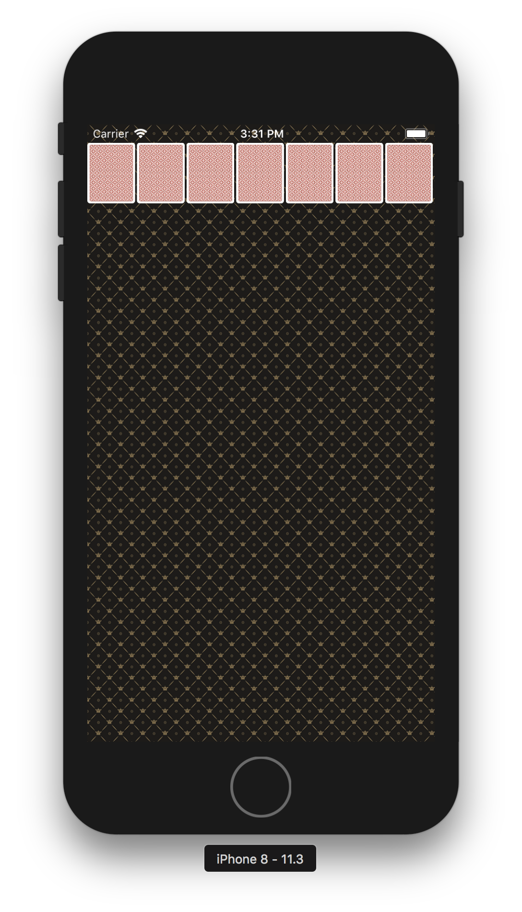
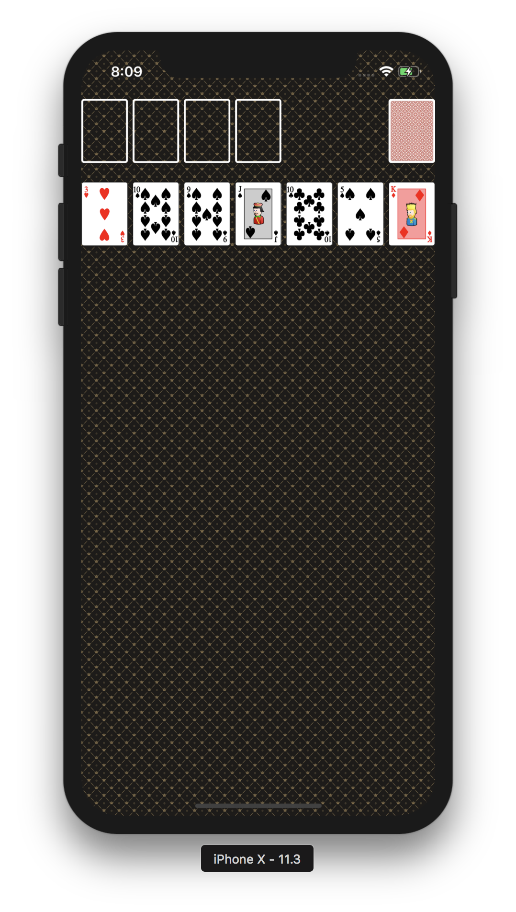
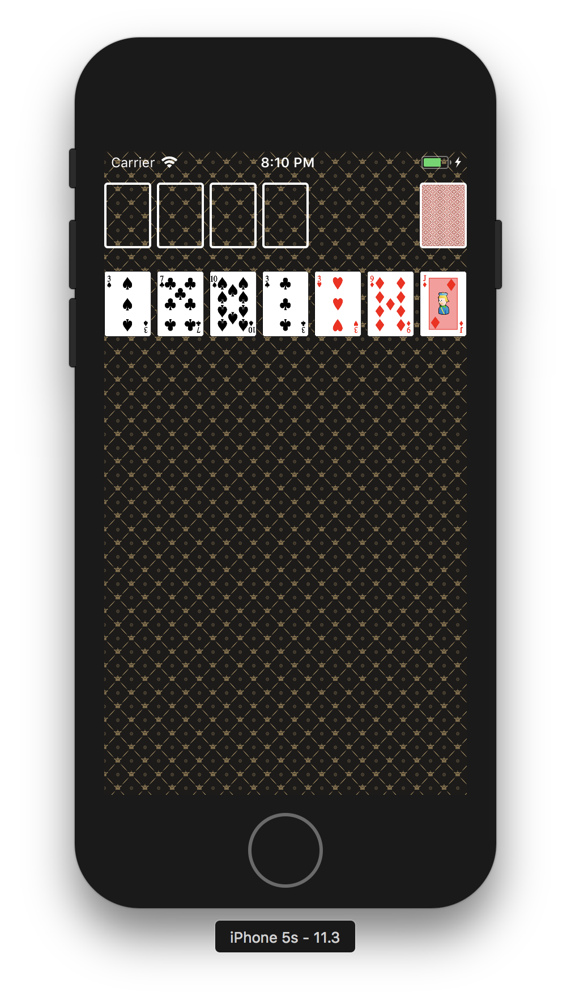
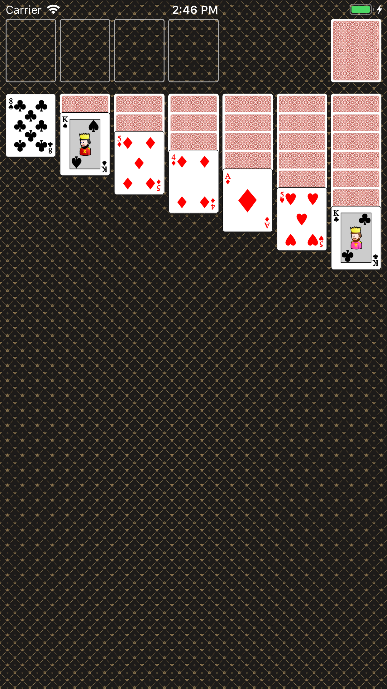
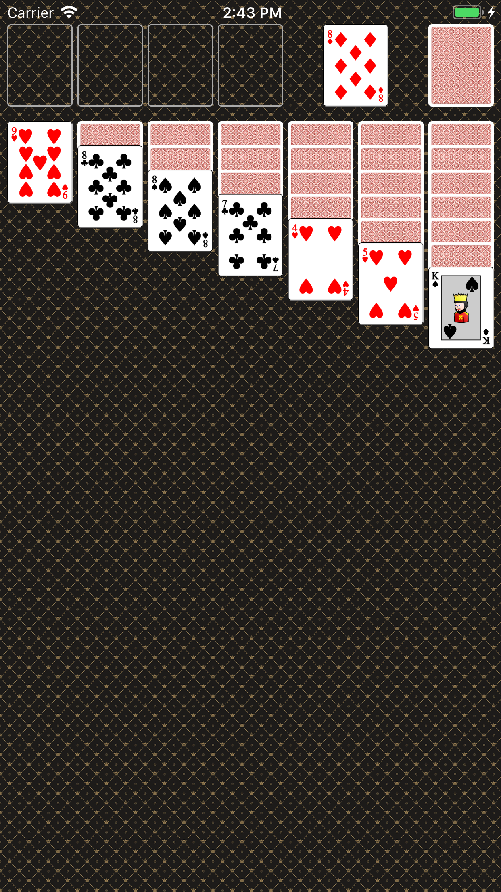
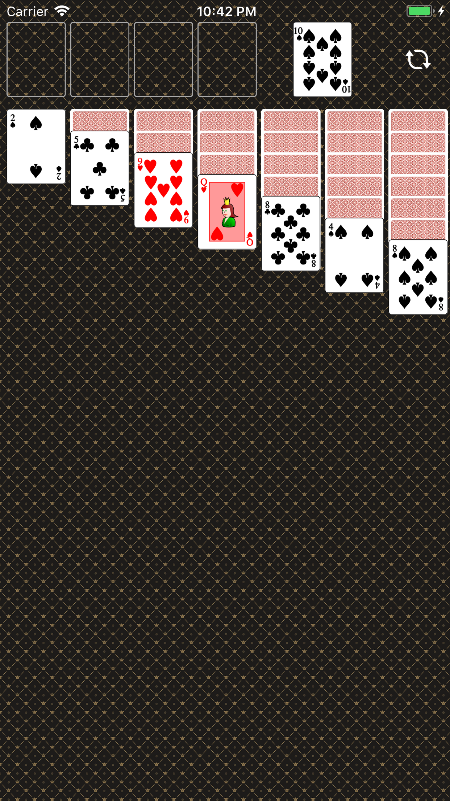
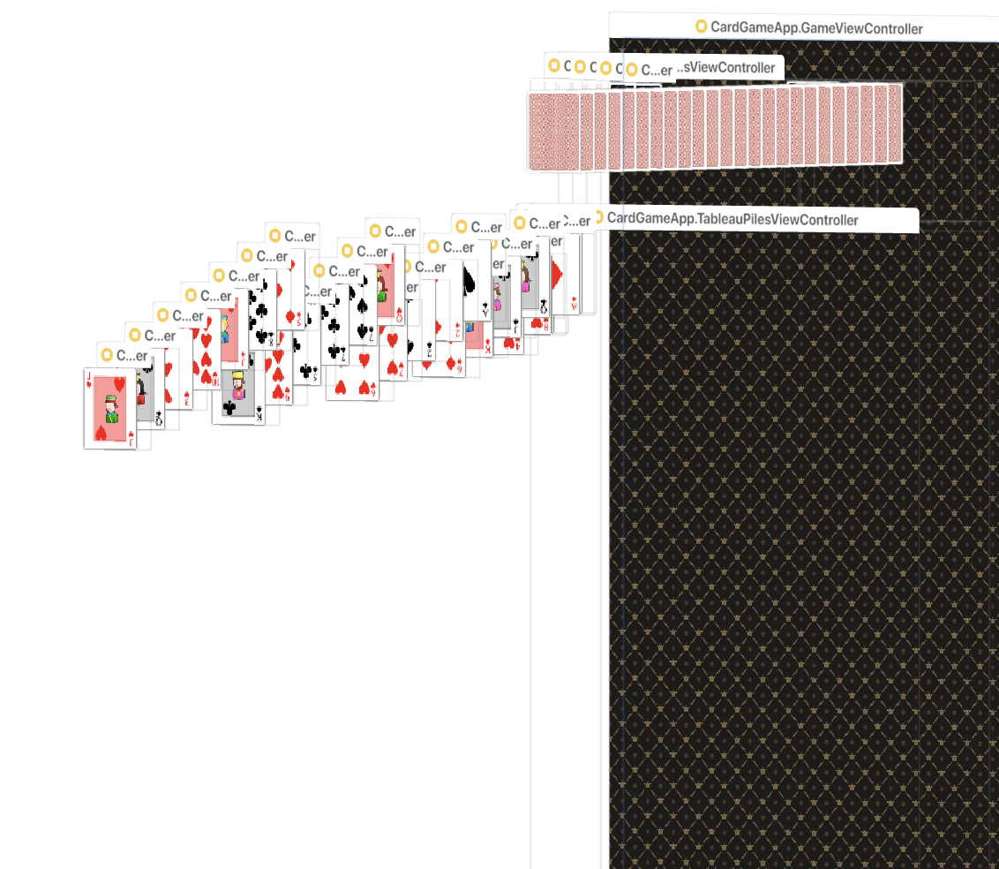

# CardGameApp

### 1. 시작하기 

##### 프로그래밍 요구사항
* 앱 기본 설정을 지정해서 StatusBar 스타일을 LightContent로 보이도록 함
* ViewController 클래스에서 self.view 배경을 다음 이미지 패턴으로 지정한다. 이미지 파일은 Assets에 추가함
* 카드 뒷면 이미지를 다운로드해서 프로젝트 Assets.xcassets에 추가함
* ViewController 클래스에서 코드로 아래 출력 화면처럼 화면을 균등하게 7등분해서 7개 UIImageView를 추가하고 카드 뒷면을 보여줌
* 카드 가로와 세로 비율은 1:1.27로 지정함

##### 실행결과 

</img>

##### 학습거리
* 화면 크기에 따라 코드로 View를 생성하고 화면에 추가하는 방식을 학습함
* 앱 기본 설정(Info.plist)을 변경하는 방식에 대해 학습함

### 2. 카드 UI

##### 프로그래밍 요구사항
* 레벨2 CardGame 미션의 Main, InputView, OutputView를 제외하고 전체 클래스를 프로젝트로 복사함
* 기존 코드들은 MVC 중에서 대부분 Model의 역할을 담당함
* 다음 링크에서 카드 이미지를 다운로드 받아서 Assets에 추가함. 파일이름을 바꾸지말고 그대로 활용함
* Card 객체에 파일명을 매치해서 해당 카드 이미지를 return 하는 메소드를 추가함
* Card 객체가 앞면, 뒷면을 처리할 수 있도록 개선함
* CardDeck 인스턴스를 만들고 랜덤으로 카드를 섞고 출력 화면처럼 보이도록 개선함
* 화면 위쪽에 빈 공간을 표시하는 UIView를 4개 추가하고, 우측 상단에 UIImageView를 추가함
    * 상단 화면 요소의 y 좌표는 20pt를 기준으로 함
    * 7장의 카드 이미지 y 좌표는 100pt를 기준으로 함
* 앱에서 Shake 이벤트를 발생하면 랜덤 카드를 다시 섞고 다시 그리도록 구현함

##### 실행결과

</img>
</img>

##### 학습거리
* [The Ultimate Guide To iPhone Resolutions](https://www.paintcodeapp.com/news/ultimate-guide-to-iphone-resolutions)
* [Demystifying iOS Layout](http://tech.gc.com/demystifying-ios-layout/)
* [프로젝트 이미지 추가하기](https://wiki.yuaming.com/ios/adding-images-in-project.html) 
* Simulator에서 Shake 이벤트 발생시키기
    * _Command + Control + z_ 
* View Model 역할에 대해 간단 정리
    * View와 Model이 직접적으로 관계를 맺지 않고 다리 역할을 함
    * Model의 데이터를 View에 맞게 가공함
    * ViewModel 속성을 이용하여 테스트 할 수 있음 
    * [[RxSwift][Swift3]POP를 이용하여 더 나은 MVVM 구조 만들기](http://minsone.github.io/programming/better-mvvm-architecture-from-kickstarter-oss)

### 3. 카드 스택 화면 표시

##### 프로그래밍 요구사항
* CardDeck 객체에서 랜덤으로 카드를 섞고, 출력 화면처럼 카드스택 형태로 보이도록 개선함
    * 카드스택을 관리하는 모델 객체를 설계함
    * 각 스택의 맨위의 카드만 앞카드로 뒤집음
* 카드스택에 표시한 카드를 제외하고 남은 카드를 우측 상단에 뒤집힌 상태로 쌓아놓음
* 맨위에 있는 카드를 터치하면 좌측에 카드 앞면을 표시하고, 다음 카드 뒷면을 표시함
* 만약 남은 카드가 없는 경우는 우측에도 빈 카드를 대신해서 반복할 수 있다는 이미지(Refresh)를 표시함
* 앱에서 Shake 이벤트를 발생하면 랜덤 카드를 다시 섞고 처음 상태로 다시 그리도록 구현함

##### 출력화면

</img>
</img>
</img>

##### 실행결과
* 원하는 결과가 나왔지만, View 구조는 내가 생각하던 결과가 아니였음. TableauPileViewController 안에 Pile 속해 있는 View가 관리되기 원했음

</img>
</img>

##### 학습거리 
* UIStackView
    * [정리](https://wiki.yuaming.com/ios/auto-layout.html)
    * [개발자 문서](https://developer.apple.com/documentation/uikit/uistackview)
* [해당 소스 분석 후, 카드게임 테스트 적용해보기](https://github.com/asmtechnology/Lesson12.iOSTesting.2017.Apress)
