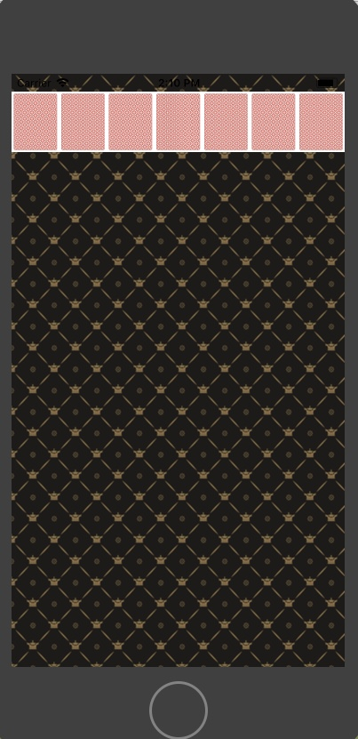
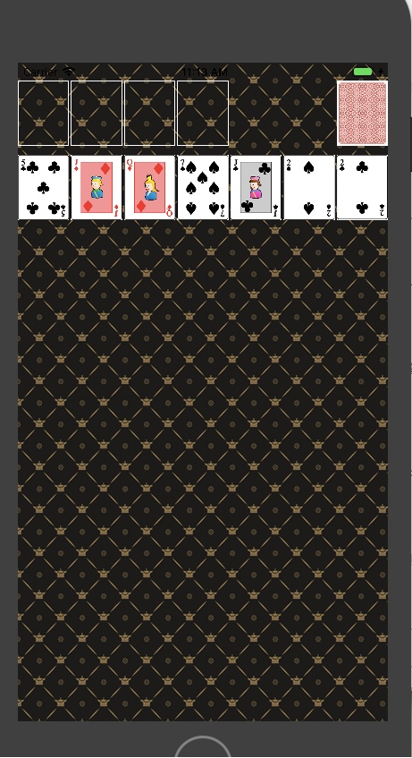

## 카드게임 앱

### step-1

#### 요구사항

- 앱 기본 설정을 지정해서 StatusBar 스타일을 LightContent로 보이도록 한다.
- ViewController 클래스에서 self.view 배경을 다음 이미지 패턴으로 지정한다. 이미지 파일은 Assets에 추가한다.
- ViewController 클래스에서 코드로 아래 출력 화면처럼 화면을 균등하게 7등분해서 7개 UIImageView를 추가하고 카드 뒷면을 보여준다.
- 카드 가로와 세로 비율은 1:1.27로 지정한다.

#### 실행 화면

### step-2

#### 실행화면

