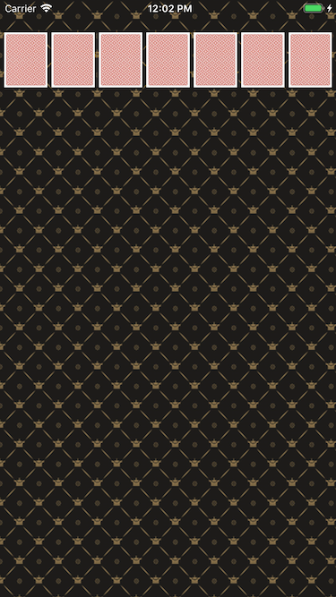
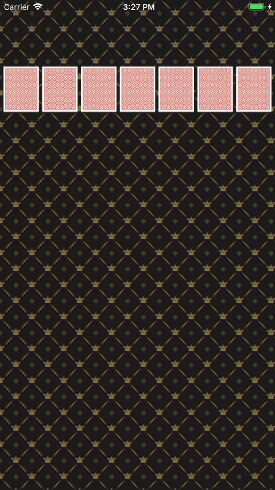
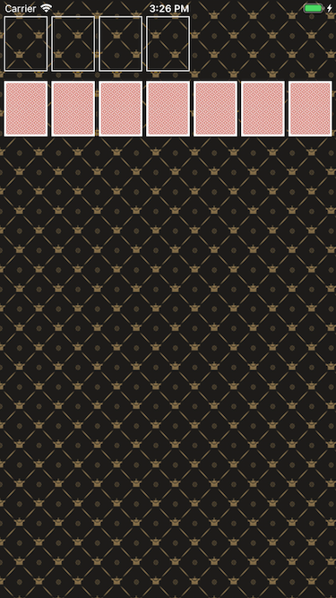
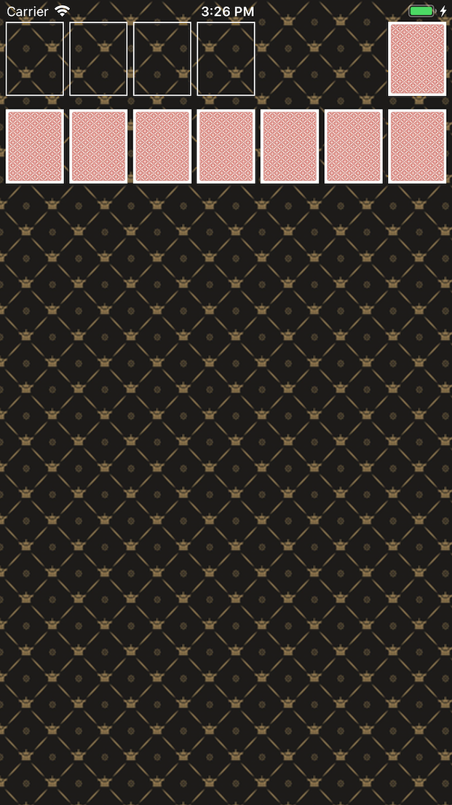
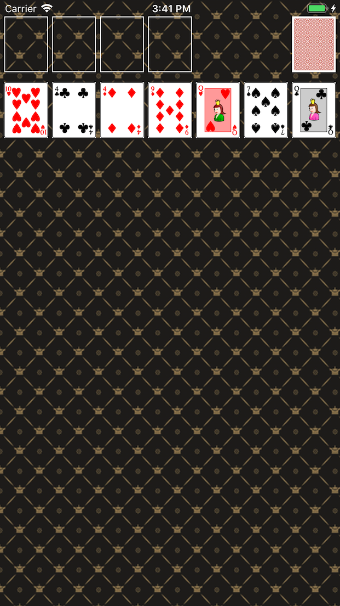
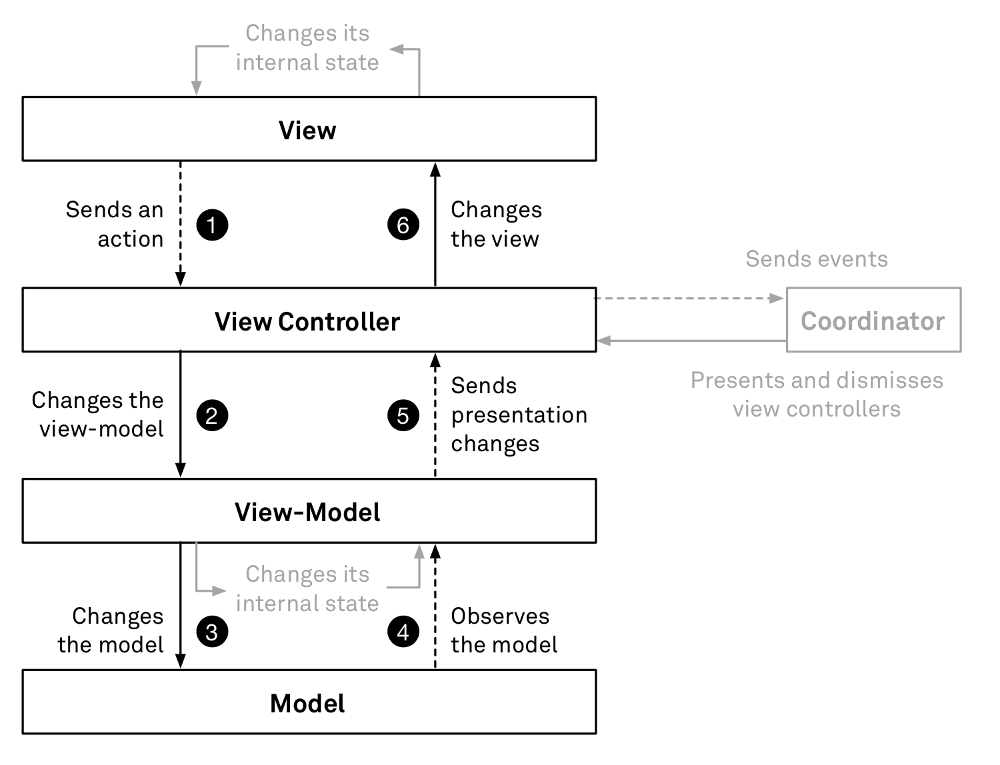
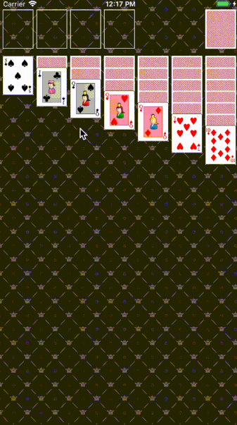

# CardGameApp

# Step1
> 이미지 작업 및 배치

### 작업내용
1. status bar .lightContent 로 변경
2. PatternUIView 커스텀 생성
3. CardBackUIImageView 커스텀 생성
     - UIImageView를 만들 때 상위뷰의 frame을 알 수 없기에 resize 함수를 만들어 크기 조절
     - 여유공간을 전체크기의 10%로 기준을 잡고 나머지를 7등분하여 카드크기 계산

### 시간이 걸린 부분
 - xcode의 타겟을 8+로 지정했지만 스토리보드에서는 8+로 지정하지 않아 frame 계산할 때 원하는대로 나오지 않음

### 첨부파일

# Step2
> 카드 UI

### 작업내용
1. 레벨2 CardGame 코드 복사
2. 카드 이미지 다운로드
3. Card 객체에 파일명 매치 및 해당 카드 이미지 리턴 메소드 추가
4. Card 객체가 앞, 뒤면 처리하도록 개선
5. CardDeck 인스턴스 생성 및 랜덤 카드 섞고 컬렉션(Collection)에 쌓기
6. 컬렉션에서 카드 7개 가져와서 아래 기본 세팅
7. 화면 위쪽에 빈 공간 표시(CardStorage)하는 UIImageView 4개 추가 , 우측 상단에 UIImageView 추가
    - 상단 화면 요소의 y 좌표는 20pt 기준
    - 7장의 카드 이미지 y 좌표는 100pt 기준
8. 앱에서 Shake 이벤트 발생하면 랜덤 카드를 다시 섞고 다시 그리도록 구현

### 첨부파일

# Step3
> 카드 배치

### 작업 내용
1. (Step3) 제스처 추가 in CardUIImageView
2. 제스처와 카드 뒤집기 연결 
    1. Card 속성 추가 in CardUIImageView
    2. turnOver in Card 와 gesture in CardUIImageView 연결
    3. CardUIImageView init 변경 : override init(image) → init(card) with super.init(image)
3. ReverseBoxView 생성, Background UIView에 addSubView 및 위치 조절 (처음 뒤집어진 상태의 자리)
4. reverseBox 에 위치한 카드들을 Background UIView 가 아닌 ReverseBoxView 위에 addSubView 하도록 수정
5. BoxView 생성, Background UIView 에 addSubView 및 위치 조절 (ReverseBoxView의 카드들을 클릭했을 때 앞면을 보이며 넘어오는 자리)
6. BoxView, ReverseBoxView 싱글톤 구현 - PatternUIView, CardUIImageView 에서 동일한 객체를 사용하기 위함
7. 카드 뒤집기(ReverseBoxView → BoxView 로 옮기기)
    1. 이벤트 중복 처리 : ReverseView에 있는 것만 이동하기 위해 superView로 상위 뷰를 확인하고  분기처리
    2. 카드 이동 : removeFromSuperview 를 사용하려 했으나 제거만 될 뿐 리턴값을 받지 못해 사용할 수 없었고 그 대신 서브스크립트를 사용하여 카드를 addSubView 하여 제거 & 추가(즉, 이동)가 가능하였습니다. (subviews는 맨 뒤 인덱스값이 가장 앞에 위치하는 아이템)
8. ReverseBoxView의 카드가 empty 이면 reset 화면 보이도록 함
9. refreshImage 클릭하는 경우 카드 재배치 : BoxView → ReverseBoxView
10. shake 이벤트 발생하면 BoxView 의 카드 비우는 로직 추가
11. 카드 스택 구현(아래 기본 세팅되는 카드)
    1. UIView 를 리스트로 가지는 변수를 생성
    2. 기본 틀이 되는 UIView를 PatternUIView에 추가 및 1번에서 만든 변수에 추가
    3. 만든 틀에 1번에서 만든 변수와 카드를 이용해서 기본 세팅
    4. 맨 위에 카드만 앞으로 뒤집어 놓기
    
### 첨부파일

# Step4
> MVVM 아키텍처 패턴 최대한 구현(리팩토링) , 더블탭 이벤트 처리

### 작업 내용

##### Step3 리팩토링
1. 제가 생각하는 MVVM 아키텍처 패턴을 최대한 구현 해보았습니다.
    - 세 단계를 거쳐 리팩토링 진행하였습니다.
        1. BackgroundView에 집중된 대부분의 로직을 ViewController 로 이동
        2. MVVM 패턴 형태로 최대한 로직 분리 : 데이터 관리 추가
        3. Observe 패턴 지양 : 데이터 변경되면 Observe 패턴을 사용해 ViewModel 에서 ViewController 로 흘러가는 것을 ViewModel 에 데이터 추가될 때 View 에도 같이 추가하도록 변경 (TabGesture 는 Observe 패턴 사용)
2. 데이터 관리
    - 이전 : 카드를 바로 View에 추가하고 삭제하는 방식
    - 변경 : 카드를 Model 과 View 동시에 추가하고 삭제하는 방식
3. 명칭 변경
    - CardStorageView → FoundationContainerView
    - BoxView → WasteView
    - ReverseBoxView → StockView
    - CardStack → TableauContainerView
4. CardImageView 클릭 변경
    - 이전 : CardImageView에 제스처를 등록하고 클릭하면 superView 를 확인하고 StockView 일 때만 처리
    - 변경 : StockView에 CardImageView 를 addSubview 할 때 제스처를 등록하고 클릭하면 바로 처리
5. 뷰 크기 고정
    - 이전 : superView 에 따라 크기를 구하고 적용
    - 변경 : iPhone8+ 를 기준으로 크기를 구하고 적용
6. containerView 정의 (Foundation, Tableau)
    - containerView 에는 각 mold 라는 명칭의 흰색 기준선이 존재하며 이 subView 는 따로 데이터 관리를 하지 않습니다. 각 containerView
7. 공통된 모델 `CardStack` 을 생성하고 각 ViewModel 에서 관리 하도록 수정
8. 공통된 함수 혹은 역할있는 클래스는 프로토콜로 묶어 사용

##### Step4
1. 더블탭 이벤트 처리

### 전체적인 구조
- ViewController : 뷰모델과 뷰 중간에 위치하여 뷰모델을 통해 모델을 수정하고 뷰에게 데이터를 다시 그릴 수 있도록 요청하는 객체
- View : `DataSource`를 이용해 데이터를 직접 소유하지 않고 모델을 참조해 데이터를 그리는 객체
- ViewModel : 뷰모델에서는 `CardStack`을 가지고 있고 이를 관리하는 객체
- Model : `Card` 를 객체로 가지고 있으며 `Stack` 의 형태를 가지고 있는 객체

### MVVM 구조

### 첨부파일

# Step5
> 드래그 구현

### 작업내용
1. dataSource 접근 방식 변경 : 객체 함수로 전체 데이터 가져오기 -> 클로저 사용
2. draw 함수 이름 변경 및 setNeedsLayout 사용
3. 드래그 관련된 프로토콜, 함수 등 구현
4. 앱 아이콘 등록

### 첨부파일

# Step6
> 클래스 다이어그램

### 클래스 다이어그램

