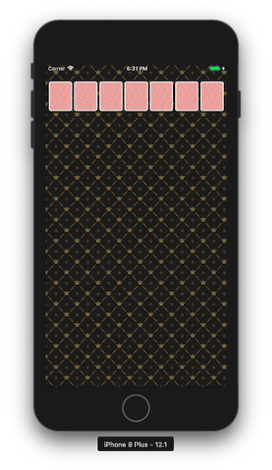

# 카드게임 앱

1. <a href="#1-카드게임판-시작하기">카드게임판 시작하기</a>
2. <a href="#2-카드-UI">카드 UI</a>

<br>

## 1. 카드게임판 시작하기

### 요구사항

- StatusBar 스타일 변경
- ViewController 루트 뷰 배경이미지 지정
- 화면에서 카드가 적정 위치에 균등하게 보이도록 ViewController 에서 이미지 뷰 추가

<br>

### 구현방법

#### 1. StatusBar 스타일 변경

처음에는 `AppDelegate` 에서 `UIApplication.shared` 의 `setStatusBarStyle()` 메소드로 스타일을 변경하려고했습니다. [공식문서](https://developer.apple.com/documentation/uikit/uiapplication/1622923-setstatusbarstyle)를 찾아보니 이 방법은 Deprecated되었으며, iOS 7 이후 부터는 status bar를 뷰 컨트롤러가 관리한다고 명시되어있었습니다. 

따라서, `ViewController` 클래스에서 **preferredStatusBarStyle** 프로퍼티를 오버라이드하여 **UIStatusBarStyle.lightContent**로 지정했습니다.

<br>

#### 2. ViewController 루트 뷰 배경이미지 지정

Assets.xcassets에 저장한 파일로 UIImage를 생성한 후, 이 이미지를 패턴으로 하는 [UIColor](https://developer.apple.com/documentation/uikit/uicolor/1621933-init)를 뷰 컨트롤러 루트 뷰의 `backgroundColor` 로 지정했습니다.

```swift
private func setBackground() {
    guard let image = UIImage(named: "bg_pattern.png") else { return }
    self.view.backgroundColor = UIColor(patternImage: image)
}
```

<br>

#### 3. ViewController에서 화면에 균일하게 카드 이미지 뷰 추가

`UIImageView` 를 상속받는 `CardImageView` 커스텀 뷰를 생성하여, 이미지 뷰 왼쪽 위 좌표**(origin: CGPoint)**와 가로 길이**(width: CGFloat)**로 생성초기화하는 convenience init 메소드를 구현했습니다.

뷰 컨트롤러 내부에는 `CardImageViewCreater` 라는 구조체를 추가하여, 뷰 컨트롤러 루트 뷰의 **frame.width** 값을 바탕으로 `CardImageView` 의 좌표와 가로 길이를 계산하여 생성해주도록 구현했습니다. 이렇게 생성된 이미지 뷰는 루트 뷰의 서브 뷰로 추가되어 화면에 균등한 크기와 여백으로 나타나게됩니다.

```swift
class ViewController: UIViewController {
    ...
	private func addCardImageViews() {
        let cardCreater = CardImageViewCreater(numberOfCards: 7, sideMargin: 5, topMargin: 40)
        let cards = cardCreater.createHorizontally(within: self.view.frame.width)
        cards.forEach { self.view.addSubview($0) }
    }
    ...
}
```

<br>

### 실행화면

> 완성일자: 2019.01.23 18:32




<br>

## 2. 카드 UI

### 요구사항

- 레벨 2 CardGame 미션 프로젝트 코드 가져와서 사용
- Card 객체 개선
  - 해당 카드 이미지 매치
  - 앞뒷면 처리
- CardDeck 인스턴스 생성 후, 뽑은 카드를 바탕으로 주어진 화면과 동일하게 뷰 추가
- Shake 모션 이벤트 발생 시, 카드를 새롭게 뽑아 뷰에 반영

<br>

### 구현방법

#### 1. Card 클래스 객체 개선

지난 [카드게임 프로젝트](https://github.com/popsmile/swift-cardgame/tree/popsmile)에서 Main, Input/OutputView와 관련된 파일을 제외한 나머지 코드를 그대로 가져와 추가했습니다. 카드에 활용할 이미지파일도 프로젝트에 추가해주었습니다.

`Card` 클래스에 앞면인지, 뒷면인지 판단할 수 있는 프로퍼티 `isBack`과 뒤집는 메소드 `flip()`을 추가했습니다. 그리고 해당 카드와 매치되는 이미지 파일명을 프로퍼티로 추가했습니다. 만약 뒤집혀있다면 `nil` 을 리턴하도록 구현했습니다.

```swift
class Card {
	...
    private var isBack: Bool = true

    ...
    var imageName: String? {
        guard isBack else { return nil }
        guard let suit = self.suit.firstLetter else { return nil }
        return "\(suit)\(rank.value)"
    }
    
    func flip() {
        isBack.toggle()
    }
}
```

<br>

#### 2. CardDeck 에서 뽑은 카드로 화면에 뷰 추가

기존의 `CardImageView` 외에 빈 공간을 나타내는 `CardSpaceView` 클래스를 추가했습니다. 두 뷰를 모두 다루기위해 뷰 컨트롤러 내의 `CardImageViewCreater` 구조체를  `CardViewCreater` 로 이름을 바꿔주었습니다. 그리고 `Align` 열거형을 추가하여 왼쪽, 오른쪽 정렬을 지원하도록 추가 구현했습니다.

<br>

#### 3. Shake 모션 이벤트 발생 시, 카드를 새롭게 뽑아 뷰에 반영

Shake 모션 이벤트가 발생하여  뷰 컨트롤러의 `motionEnded()` 메소드가 호출되면, 기존 카드 이미지 뷰를 삭제하고 초기화한 `cardDeck` 에서 새롭게 뽑은 카드 뷰를 추가해주도록 구현했습니다.

```swift
override func motionEnded(_ motion: UIEvent.EventSubtype, with event: UIEvent?) {
    super.motionEnded(motion, with: event)
    if motion == .motionShake {
        cardImageViews.forEach { $0.removeFromSuperview() }
        cardDeck.reset()
        addCardImageViews()
    }
}
```

<br>

### 실행화면

> 완성일자: 2019.01.25 14:35

