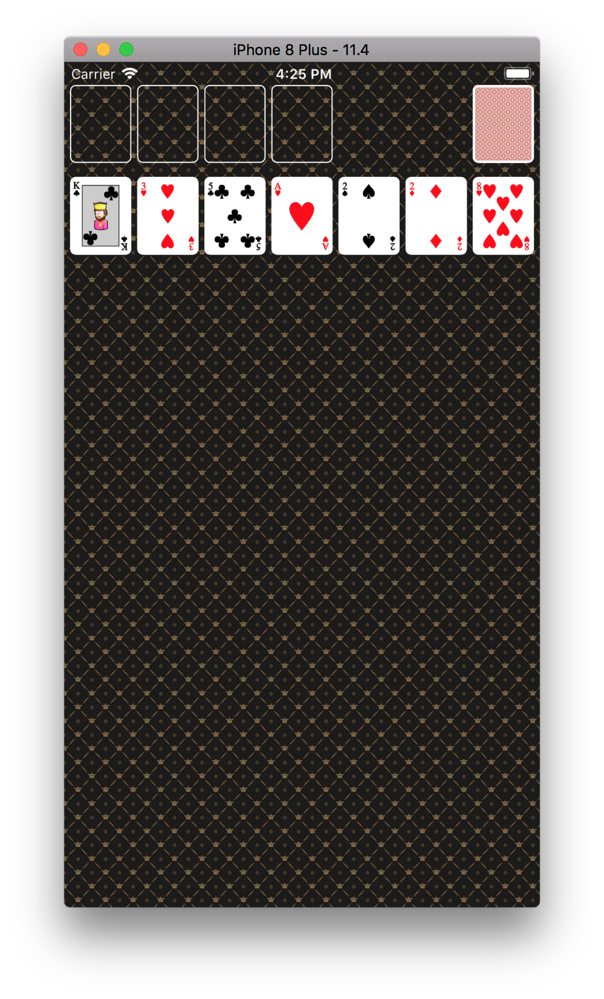

# Card Game App

## Step. 1
- Keywords
	- margin, frame, bounds, UIScreen, status bar
	- NSDirectionalEdgeInsets
		- iOS11 버전부터 지원하는 프로퍼티로 ViewController의 root view는 모두 0으로 되어있지만, UIView를 포함한 대부분의 뷰를 생성해보면 default 값으로 8임을 알 수 있다.
		- For the root view of a view controller, the default value of this property reflects the system minimum margins and safe area insets.
		- 이 값은 직접 설정할 수 있다.
		- preservesSuperviewLayoutMargins` 프로퍼티를 true를  할 경우 이 값들은 더 커질 수 있다.
- [Layout Guide, Margins, Insets and Safe Area demystified on iOS 10 & 11](https://blog.smartnsoft.com/layout-guide-margins-insets-and-safe-area-demystified-on-ios-10-11-d6e7246d7cb8)
- [directionalLayoutMargins](https://developer.apple.com/documentation/uikit/uiview/2865930-directionallayoutmargins)

## Step. 2

- [swift random unification](https://github.com/apple/swift-evolution/blob/master/proposals/0202-random-unification.md)

## Step. 3
- 객체설명
	- Card: 카드를 나타내기 위한 객체
	- CardDeck: 여러장의 카드를 나타내기 위한 객체 (처음 52장의 카드를 모아두는 카드덱)
	- CardStack: 필드에 놓여져있는 카드스택 하나
	- CardStackManager: 7개의 카드스택을 관리하는 객체
	- WastePile: 카드덱에서 제거됐지만 아직 카드스택이나 Foundation에 속하지 않은 카드들을 모아둔 객체
	- CardView: 카드한장을 나타내는 뷰
	- CardStackView: 카드스택을 나타내기 위한 뷰
	- CardStacksView: CardStackView들을 담고 있는 superview

