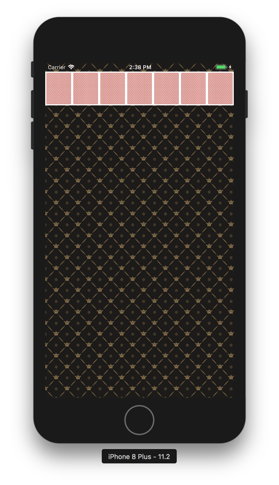

# 카드게임 앱 step 1.

#### 요구사항

- ViewController 클래스에서 self.view 배경을 다음 이미지 패턴으로 지정
- 카드 뒷면 이미지를 다운로드해서 프로젝트 Assets.xcassets에 추가
- ViewController 클래스에서 코드로 아래 출력 화면처럼 화면을 균등하게 7등분해서 7개 UIImageView를 추가하고 카드 뒷면을 표시
- 카드 가로와 세로 비율은 1:1.27로 지정

#### 적용사항

- 이미지 asset 에 추가
- 화면크기를 받아서 7등분 적용
- statusbar type 코드로 적용

-

# step 2.

#### 프로그래밍 요구사항

- 레벨2 CardGame 미션의 Main, InputView, OutputView를 제외하고 전체 클래스를 프로젝트로 복사한다.
- 기존 코드들은 MVC 중에서 대부분 Model의 역할을 담당한다.
- 다음 링크에서 카드 이미지를 다운로드 받아서 Assets에 추가한다. 파일이름을 바꾸지말고 그대로 활용한다.
- Card 객체에 파일명을 매치해서 해당 카드 이미지를 return 하는 메소드를 추가한다.
- Card 객체가 앞면, 뒷면을 처리할 수 있도록 개선한다.
- CardDeck 인스턴스를 만들고 랜덤으로 카드를 섞고 출력 화면처럼 보이도록 개선한다.
- 화면 위쪽에 빈 공간을 표시하는 UIView를 4개 추가하고, 우측 상단에 UIImageView를 추가한다.
- 상단 화면 요소의 y 좌표는 20pt를 기준으로 한다.
- 7장의 카드 이미지 y 좌표는 100pt를 기준으로 한다.
- 앱에서 Shake 이벤트를 발생하면 랜덤 카드를 다시 섞고 다시 그리도록 구현한다.

#### 작동화면

#### 적용사항

- autoLayout 사용하지 않고 코드로 패딩 구현

# step 3

#### 프로그래밍 요구사항 

- CardDeck 객체에서 랜덤으로 카드를 섞고, 출력 화면처럼 카드스택 형태로 보이도록 개선한다.
- 카드스택을 관리하는 모델 객체를 설계한다.
각 스택의 맨위의 카드만 앞카드로 뒤집는다.
- 카드스택에 표시한 카드를 제외하고 남은 카드를 우측 상단에 뒤집힌 상태로 쌓아놓는다.
- 맨위에 있는 카드를 터치하면 좌측에 카드 앞면을 표시하고, 다음 카드 뒷면을 표시한다.
- 만약 남은 카드가 없는 경우는 우측에도 빈 카드를 대신해서 반복할 수 있다는 이미지(refresh)를 표시한다.
- 앱에서 Shake 이벤트를 발생하면 랜덤 카드를 다시 섞고 처음 상태로 다시 그리도록 구현한다.

#### 작동화면

#### 구현내용

- 덱 카드뷰에 터치 제스처 추가. 인터랙션 허용
- 제스처 이벤트가 발생시 왼쪽으로 카드뷰 이동. 인터랙션 불가 처리
- 리프레시 를 위해서 뷰를 배열로 처리
- 리프래시 함수 작동시 위치 원복
- 리셋시 카드뷰를 삭제하고 재생성

-

# step 4

#### 프로그래밍 요구사항 

- 이벤트 처리하는 객체와 애니메이션을 담당하는 객체 역할을 구분해서 설계한다.
- 좌측 상단 카드묶음과 스택 카드묶음을 담당할 객체를 구현한다.
- 카드마다 UIImageView에서 더블탭 이벤트를 처리하도록 제스처 인식기를 연결한다.
- 더블탭은 앞면으로 뒤집혀 있는 카드만 처리한다. 뒷면인 카드는 무시한다.
- 만약 A카드인 경우 왼쪽 상단의 비어있는 칸으로 UIImageView를 animate 시킨다.
- 기존에 다른 A카드가 있으면 그 옆으로 이동한다.
K카드인 경우 스택 중에서 좌측부터 빈 칸이 있으면 빈 칸으로 이동시킨다.
- 나머지 2이상 카드인 경우 왼쪽 상단에 같은 모양의 A가 있는 경우는 그 위로 이동시킨다.
- 상단으로 이동할 수 없는 경우, 스택 중에서 좌측부터 앞면으로 된 카드 중 가장 위에 있는 카드와 다음 조건을 확인하고 조건에 맞으면 그 위로 이동시킨다.
- 숫자가 하나 큰 카드가 있는지 확인한다. 
- ex) 터치한 카드가 2인 경우 3, 10인 경우 J
모양의 색이 다른지 확인한다. ex) 터치한 카드가 ♠️♣️ 이면 ♥️♦️
스택에서 마지막 카드가 다른 곳으로 이동한 경우 다시 마지막 카드를 앞면으로 뒤집는다
- 앱에서 Shake 이벤트를 발생하면 랜덤 카드를 다시 섞고 처음 상태로 다시 그리도록 구현한다.

#### 작동화면

#### 구현내용

- 카드객체 함수추가 : 카드모양,넘버 비교함수
- 덱뷰, 포인트덱뷰, 플레이덱뷰, 오픈덱뷰 생성 - 카드뷰를 소지
- 터치이벤트 구성 - 1터치,2터치
- 1터치 : 카드 덱 뒤집기 전용. 카드가 윗면일 경우에만 작동
- 2터치 : 카드 이동 전용. 카드가 앞면일 경우에만 작동
- 카드 이동 시도시 뷰가 가진 카드정보를 모델로 전송
- 모델에서는 카드정보를 받아서 카드이동 시도
- 실패시 변화없음
- 시도 함수는 카드정보를 받아서 해당 카드가 이동가능한 곳이 있는지 체크
- 체크함수는 각 덱의 마지막 카드와 비교
- 성공시 카드 이동 전 위치정보를 담아서 노티피케이션 포스트
- 뷰컨에서 이동전 정보를 받아서 해당 뷰와 비교
- 해당뷰의 카드정보가 변경되었을 경우 변경된 위치로 뷰 이동

-

# step 5

#### 요구사항 

- 앞으로 뒤집힌 카드 묶음을 드래그 앤 드롭할 수 있도록 개선한다.
- ViewController에서 터치 이벤트를 처리하도록 이벤트 핸들러를 추가한다.
	*	터치가 시작하면 누른 위치에 있는 카드를 찾고, 앞면으로 뒤집혀 있는 카드만 처리한다. 뒷면인 카드는 무시한다.
		+ 터치가 움직이면 터치 시작 위치와 차이만큼 누른 위치 카드를 이동시킨다.
		+ 만약 터치한 카드 아래에 다른 카드가 쌓여있는 경우는 함께 드래그 한다.
	*	터치를 놓았을 때 위치에 따라서 함께 드래그 하는 카드 묶음을 조건을 비교해서 이동시킨다.
		+ 터치한 카드가 K인 경우는 스택 공간 중에 빈 칸으로 이동가능하다.
		+ 나머지 카드인 경우 가장 위에 있는 카드와 다음 조건을 확인하고 조건에 맞으면 그 위로 이동시킨다.
		+ 숫자가 하나 큰 카드가 있는지 확인한다. ex) 터치한 카드가 2인 경우 3, 10인 경우 J
		+ 모양의 색이 다른지 확인한다. ex) 터치한 카드가 ♠️♣️ 이면 ♥️♦️
	*	우측 위쪽의 카드로 마찬가지 규칙에 맞춰서 카드를 이동시킨다.
- 스택에서 마지막 카드가 다른 곳으로 이동한 경우 다시 마지막 카드를 앞면으로 뒤집는다
- 앱에서 Shake 이벤트를 발생하면 랜덤 카드를 다시 섞고 처음 상태로 다시 그리도록 구현한다.
- 모든 카드가 좌측 상단에 순서대로 쌓인 경우는 축하메시지를 출력한다.

#### 작동화면

#### 구현내용

- 드래그 이동 : UIPanGesture 이용
	* 드래그에 쓸 UIVIew 를 미리 뷰컨에 추가 : dragView
	* 제스처 시작시 이벤트 시작된 뷰의 메인뷰 내부 위치 계산
	* 메인뷰 위치에 이벤트뷰와 같은 모양의 dragView 출력 
	* 이벤트뷰는 hidden 처리
	* 여러장인 경우에는 각 덱뷰에서 카드뷰를 배열로 받아서 dragView 생성
	* 드래그 중에는 제스처 이동거리만큼 dragView center 에 추가
	* 제스처 종료시 종료 위치의 뷰 확인
		+ 빈뷰와 기존뷰 모두 처리가능
	* 이벤트뷰와 종료위치뷰를 모델로 보내서 카드이동 이벤트 진행
	* 여러장 이동시에 임시뷰를 거쳐서 이동 - 순서를 역순으로 추가필요
	* 카드 이동 성공,실패시 노티를 보내서 뷰도 같이 이동

- 게임 클리어 메세지 추가 : 카드 이동시마다 조건체크, 완료시 Alert 사용

