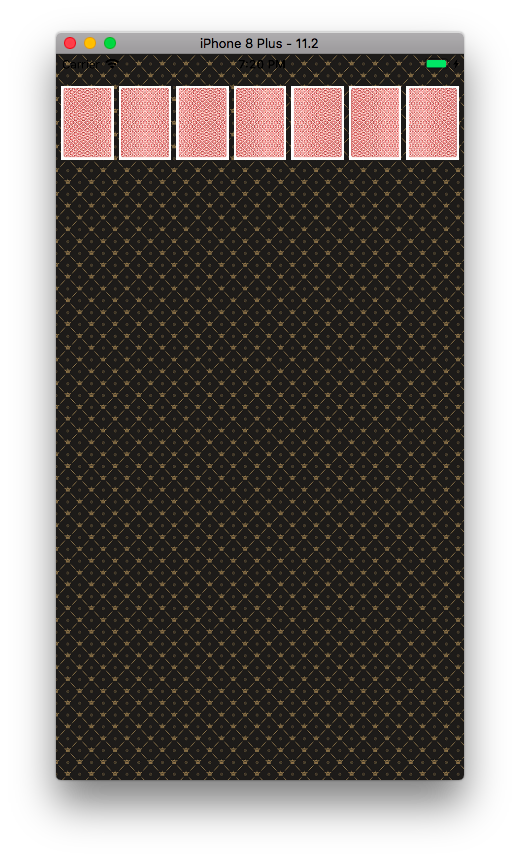

# 카드게임 앱 Step1
## 프로그래밍 요구사항
* ViewController 클래스에서 코드로 아래 출력 화면처럼 화면을 균등하게 7등분해서 7개 UIImageView를 추가하고 카드 뒷면을 보여준다.

디바이스의 크기마다 카드의 가로크기와 마진을 조절해줘야하기 때문에 다음과 같은 코드가 필요하다.
```swift
class CardView: UIView {
    func makeCardView(screenWidth: CGFloat, index: Int) -> UIImageView {
        let marginRatio: CGFloat = 70
        let cardsNumber: CGFloat = 7
        let cardWidth = (screenWidth / cardsNumber) - (screenWidth / marginRatio)
        let margin = (screenWidth - (cardWidth * cardsNumber)) / (cardsNumber + 1)
        let card = UIImageView(image: UIImage(named: "card_back"))
        let xCoordinate = ((cardWidth + margin) * CGFloat(index)) + margin
        card.frame = CGRect(x: xCoordinate, y: 32, width: cardWidth, height: (screenWidth / cardsNumber) * 1.27)
        return card
    }
}
```
screenWidth는 디바이스의 가로크기를 받아온다. ```let screenWidth = UIScreen.main.fixedCoordinateSpace.bounds.width```그리고 받아온 크기별로
카드의 가로크기를 marginRatio로 지정하여준다. 그리고 마진은 7장이필요하다면 8개의 마진이 필요하기 때문에 8로 나누어 준다.

