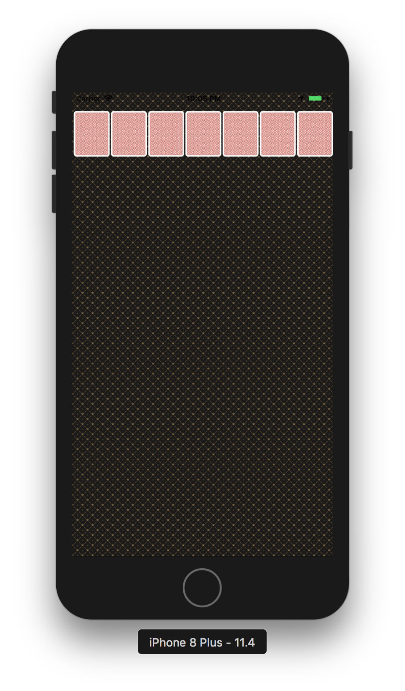
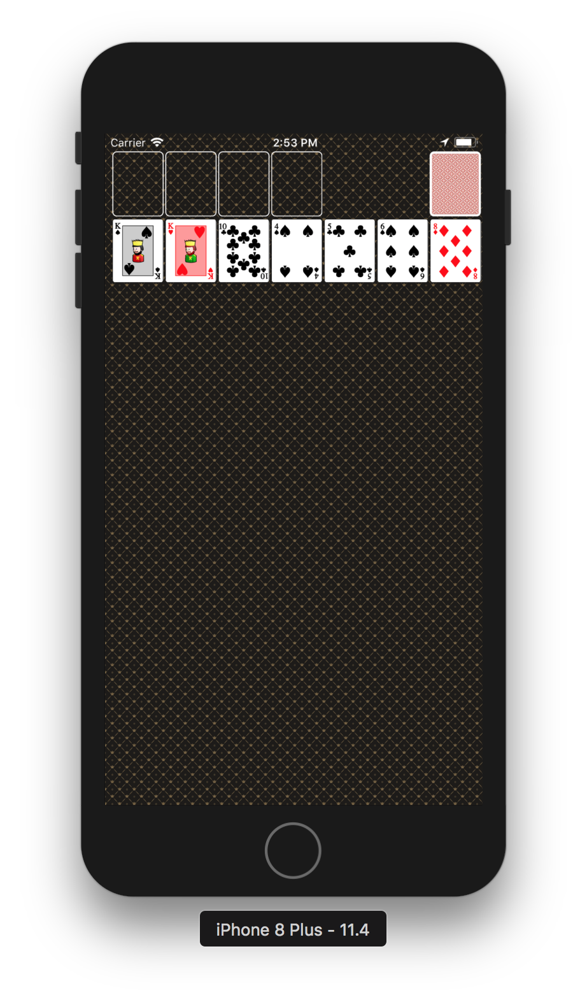

# CardGame Step1

## iPhone 프로젝트 설정
- 시뮬레이터: iPhone 8
- Deployment Info > Status Bar Style: Light

## 요구사항
- ViewController 클래스에서 self.view 배경을 다음 이미지 패턴으로 지정한다. 이미지 파일은 Assets에 추가한다.
- ViewController 클래스에서 코드로 아래 출력 화면처럼 화면을 균등하게 7등분해서 7개 UIImageView를 추가하고 카드 뒷면을 보여준다.

	* cell로 카드를 생성
	* numberOfItemInSection 7개 구성

- 카드 가로와 세로 비율은 1:1.27로 지정한다.

	* margin과 width로 카드의 크기 지정
	* sizeforItemAt함수 사용
	* minimumInteritemSpacingForSectionAt로 cell 간격 지정

# CardGame Step2

- BaseVC, BaseView 생성
	-	BaseVC: UIViewContoller를 상속하여 setupView 함수를 viewdidload에서 호출
	- BaseView: UIView를 상속하여 setupView를 초기화시 호출하여 view를 생성

- 구조

