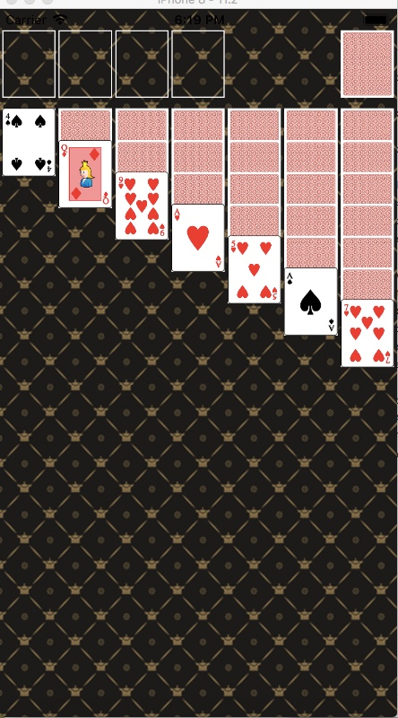
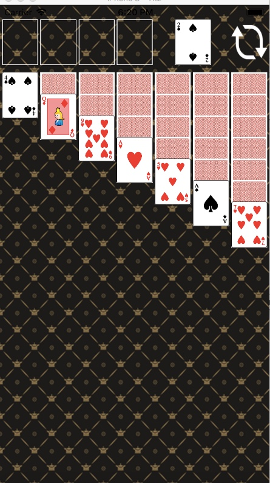

## 카드게임 앱

### step-1

#### 요구사항

- 앱 기본 설정을 지정해서 StatusBar 스타일을 LightContent로 보이도록 한다.
- ViewController 클래스에서 self.view 배경을 다음 이미지 패턴으로 지정한다. 이미지 파일은 Assets에 추가한다.
- ViewController 클래스에서 코드로 아래 출력 화면처럼 화면을 균등하게 7등분해서 7개 UIImageView를 추가하고 카드 뒷면을 보여준다.
- 카드 가로와 세로 비율은 1:1.27로 지정한다.

#### 실행 화면

### step-2

#### 실행화면

### step-3

#### 실행화면

#### step-4

#### 요구사항

#### 뷰 컨트롤러 초기화

- init(nibName:bundle:)

  지정된 이니셜라이저이다. 뷰 컨트롤러를 정의하기 위해 스토리보드를 사용할 때, 뷰 컨트롤러를 직접 초기화하지 않는다. 

  대신, 뷰 컨트롤러는 segue에 의해 자동적으로 혹은 스토리보드 객체의 메소드인 instantiateViewController(withIdentifier:)을 호출할 때 프로그램에 따라 스토리보드에 의해 초기화된다.

  스토리보드로 뷰 컨트롤러를 초기화 할 때, iOS는 이 메소드 대신 init(coder:)를 호출하면서 새로운 뷰 컨트롤러를 만든다.

- removeFromSuperView()

  - Unlinks the view from its superview and its window, and removes it from the responder chain.

#### UIView Layout Subviews

- Lay out views manually if your app does not use Auto Layout
- layoutSubviews()
  - 기본 구현은 하위 뷰의 크기와 위치를 결정하기 위해 설정한 제약 조건을 사용한다.
  - 서브 클래스는 갖고 있는 서브 뷰들의 정확한 레이아웃을 수행하기 위해 이 메소드를 오버라이드 할 수 있다.
  - 하위 뷰의 자동 크기 조정 및 constraint 기반 동작이 원하는 동작을 제공하지 않는 경우에만 메서드를 재정의한다.
  - 이 메소드를 구현함으로써 서브 뷰의 프레임 사각형을 직접 설정할 수 있다.
  - 이 메소드는 직접 호출하지 않는다.
  - 강제로 레이아웃을 업데이트하려면 다음 업데이트 드로잉 이전에 setNeedsLayout() 을 호출해야 한다.
  - 뷰의 레이아웃을 즉시 업데이트하려면 layoutIfNeeded() 메소드를 호출한다.
- setNeedsLayout()
  - Receiver의 현재 레이아웃을 무효화하고 다음 업데이트 주기에 레이아웃 업데이트를 발생시킨다.
  - 서브뷰들의 레이아웃을 조정하고 싶을 때 앱의 메인 스레드에서 이 메소드를 호출하라.
  -  이 메소드는 요청을 기록하고 즉시 리턴한다.
  - 이 메소드는 즉각적인 업데이트를 강제하지 않지만 다음 업데이트 사이클까지 기다리기 때문에 어떤 뷰든지간에 업데이트 되기 전에 다수 뷰의 레이아웃을 무효화하기 위해 사용한다.
  - 하나의 업데이트 사이클에 모든 레이아웃을 통합할 수 있다. 이는 성능을 향상시킨다.

