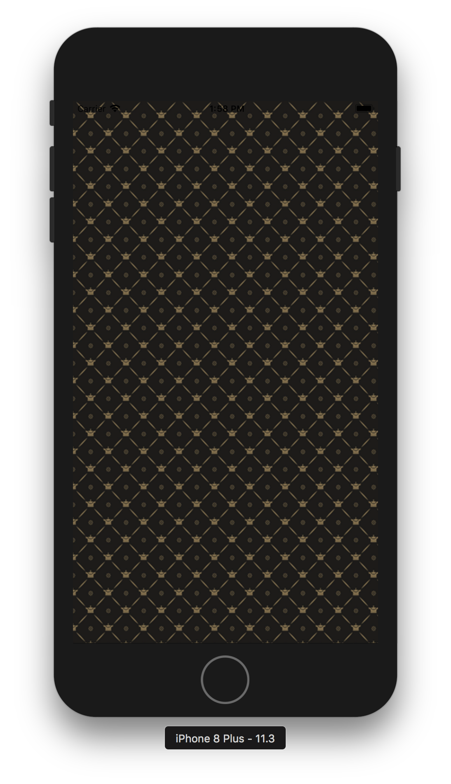
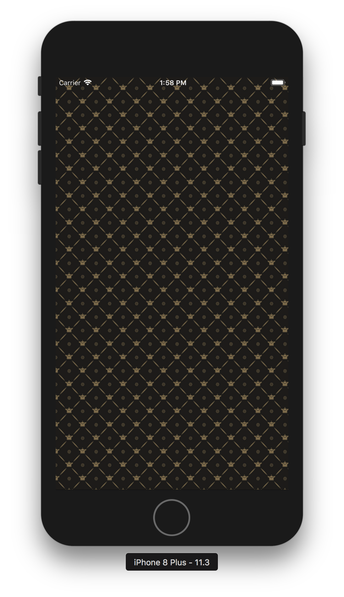
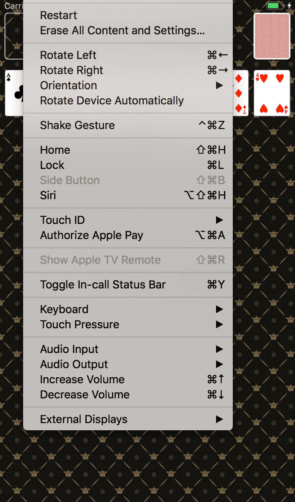
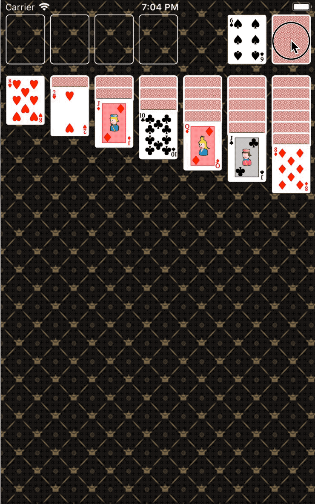

## Step1
- 구현화면 : 2018.04.12


### Status Bar Style
- 화면 상단 상태 바의 UI요소들의 색을 변경할 수 있다.
- ViewController에 아래의 코드를 넣어서 설정할 수 있다.
 ```swift
 override var preferredStatusBarStyle: UIStatusBarStyle {
		return .lightContent
}
 ```
 | .default | .lightContent     |
 | :---------- | :---------- |
 |||

## Step2
- 화면 상단에 파운데이션 네 칸, 카드뒷면을 표시하고 하단엔 카드 앞면 7장을 랜덤으로 표시한다.
- Shake Gesture를 하면 카드가 다시 랜덤으로 표시된다.
- 구현화면 : 2018.04.13


## Step3
- CardDeck 객체에서 랜덤으로 카드를 섞고, 출력 화면처럼 카드스택 형태로 보이도록 개선한다.
  - 각 스택의 맨위의 카드만 앞카드로 뒤집는다.
- 카드스택에 표시한 카드를 제외하고 남은 카드를 우측 상단에 뒤집힌 상태로 쌓아놓는다.
- 맨위에 있는 카드를 터치하면 좌측에 카드 앞면을 표시하고, 다음 카드 뒷면을 표시한다.
  - 만약 남은 카드가 없는 경우는 우측에도 빈 카드를 대신해서 반복할 수 있다는 이미지(refresh)를 표시한다.
- 앱에서 Shake 이벤트를 발생하면 랜덤 카드를 다시 섞고 처음 상태로 다시 그리도록 구현한다.

- 구현화면 : 2018.04.17


## Step4

### 사용자의 이벤트가 인식되는 구조
1. 사용자는 디바이스에서 특정 액션을 취함 (터치, 줌 등)
2. 그 액션에 해당하는 이벤트가 시스템에 의해 생성, UIKit에서 생성한 port를 통해 앱에 전달
3. 이벤트들은 앱 내부적으로 queue에 저장(FIFO)
4. UIApplication객체가 가장 먼저 이 이벤트를 받아서 어떤 동작이 취해질 지 결정
  - 터치 이벤트의 경우 main window객체가 인식하고 window객체가 다시 터치가 발생한 view로 이벤트를 전달함
  - 다른 이벤트들도 다양한 app객체에 따라 조금씩 다르게 동작

### 주로 발생되는 이벤트 처리
- Touch이벤트: **터치 이벤트가 발생한 view객체** 로 전달
  - view는 응답을 할 줄 아는(Responder) 객체이므로 터치 이벤트가 발생한 뷰 객체로 전달됨. 만약 해당 뷰에서 처리되지 않는 터치이벤트는 Responder chain을 따라 계속 내려가게됨
- Remote control / Shake motion events: **First responder object객체**
  - 미디어콘텐츠의 재생이나 되감기 등과같은 remote control이벤트는 주로 헤드폰같은 악세사리에서 발생
- Redraw: **업데이트가 필요한 객체**
  - Redraw 이벤트는 이벤트 객체를 갖지는 않고, 단순히 업데이트가 필요한 view객체에 요청
- **참고**, 이벤트 소스 종류
  - 입력소스(input source): 다른 thread나 어플리케이션에서 전달되는 메시지 이벤트(비동기식)
  - 타이머소스(timer source): 예정시간이나 반복수행간격에 따라 발생하는 이벤트(동기식)
- **Touch나 Remote Control** 같은 이벤트는 앱의 Responder객체를 통해 처리된다.
- Responder객체는 앱의 모든 곳에 존재
  - UIApplication, 커스텀 view객체, ViewController객체 모두 Responder객체에 해당된다.

Touches, Presses, and Gestures
UIResponder객체는 앱의 이벤트를 핸들링한다. 사용자로부터 입력되는 터치나 제스쳐 이벤트는 UIEvent객체로써 앱과 연결된다.
- [UIResponder](https://developer.apple.com/documentation/uikit/uiresponder)- An abstract interface for responding to and handling events.
- [UIEvent](https://developer.apple.com/documentation/uikit/uievent) - An object that describes a single user interaction with your app.

- Touches : [Handling Touches in Your View](https://developer.apple.com/documentation/uikit/touches_presses_and_gestures/handling_touches_in_your_view)
- Gestures(press, tap): [Handling UIKit Gestures](https://developer.apple.com/documentation/uikit/touches_presses_and_gestures/handling_uikit_gestures)
