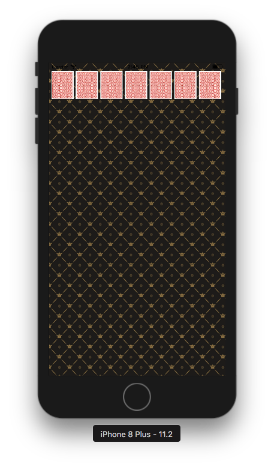
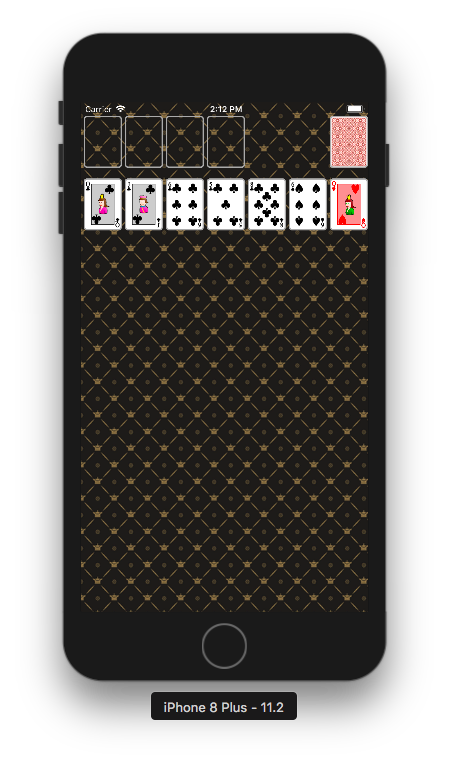
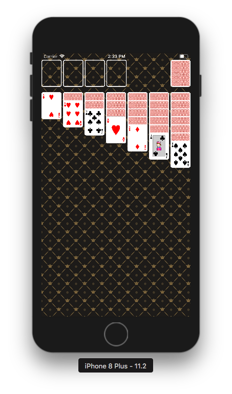
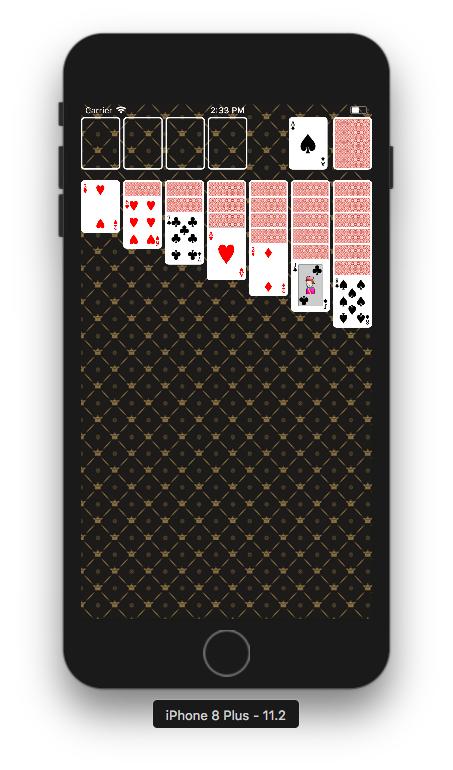
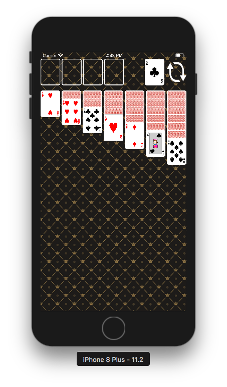

# Card Game App

## 카드게임판 준비


### iPhone 프로젝트 설정
- 시뮬레이터: iPhone 8
- Deployment Info > Status Bar Style: Light
- **info.plist > View controller-based status bar appearance: NO**

### 이미지 패턴으로 배경 설정
- 이미지 패턴으로 배경 설정

```swift
view.backgroundColor = UIColor(patternImage: .init(imageLiteralResourceName: "bg_pattern"))
```

- 뷰컨트롤러의 뷰 내부에 inset 설정

```swift
viewRespectsSystemMinimumLayoutMargins = false
view.layoutMargins = UIEdgeInsets(top: UIApplication.shared.statusBarFrame.height, left: 5, bottom: 5, right: 5)
```

- 화면을 균등하게 7등분하여 UIImageView를 추가하고 카드 뒷면 표시
- 카드 가로세로 비율 = 1 : 1.27
- 화면에 카드 나열

```swift
private func layCards() {
    var cardPosition = CGPoint(x: view.layoutMargins.left, y: view.layoutMargins.top)
    while cardPosition.x+cardSize.width <= view.frame.maxX-view.layoutMargins.right {
        let cardView = generateCard(cardPosition)
        view.addSubview(cardView)
        cardPosition = CGPoint(x: cardView.frame.maxX+cardMargins,
                               y: view.layoutMargins.top)
    }
}

```

2017-01-30 (작업시간: 1일)

## 카드 UI


### 레벨2 프로젝트 코드 복사
- **기존 코드**들은 대부분 **Model 역할**을 담당
- iOS 앱 구조는 MVC 중에서도 우선 **ViewController-Model 관계부터 집중**하고, ViewController-View 관계는 다음 단계에서 개선한다.

### 빈 카드뷰, 스페어 카드뷰 추가
- 빈 카드뷰도 CardView 클래스 사용함
- CardView에 isVacant 프로퍼티를 추가하여 true일 시 image = nil
	- 이 때, 뒤에 기타 컨트롤들이 비칠 수 있으므로 isOpaque는 true로 설정함
- 빈 카드뷰(vacant), 스페어 카드뷰(spare), 게임카드 뷰(dealed)의 위치를 지정해 놓고 해당 개수만큼 ViewController의 view에 붙임

```swift
private func initGameBoard() {
    drawBackground()
    // Deck 생성 및 셔플.
    reset()
    // 각 카드 역할별 위치
    vacantPosition = CGPoint(x: view.layoutMargins.left, y: view.layoutMargins.top)
    sparePosition = CGPoint(x: view.frame.width-(view.layoutMargins.right+cardSize.width),
                            y: view.layoutMargins.top)
    dealedPosition = CGPoint(x: view.layoutMargins.left, y: view.layoutMargins.top+cardSize.height+15)
    // 빈 공간 4장 그림
    drawVacantSpaces(4, on: vacantPosition)
    // 스페어 카드 1장 그림
    lay(cards: deck?.drawMany(selectedCount: 1), on: sparePosition, false)
    // 게임카드 7장 그림
    lay(cards: deck?.drawMany(selectedCount: 7), on: dealedPosition, true)
}
```

### Shake 이벤트 시 카드 다시 섞어 그리기
- deck을 다시 만들고 shuffle하나 후 스페어카드와 게임카드만 다시 그림.
- 위치는 전역변수로 박아놓고 써야 한다. 함수 내부에 넣거나 연산 프로퍼티 등으로 쓸 때마다 계산하게 되면 첫 번째 shake 때 위치가 변경되므로 주의.

### 학습 내용
>- **[디바이스 종류에 따른 화면크기 처리](https://www.paintcodeapp.com/news/ultimate-guide-to-iphone-resolutions)**

2017-02-01 (작업시간: 2일)

<br/>

## 카드스택으로 표시
</img></img></img>

### 랜덤으로 카드를 섞은 후 카드스택 형태로 보이도록 개선
#### 카드(Card) 객체
- 앞/뒤 이미지 **이름** 정보를 소유

#### 카드뷰(CardView) 객체
- 카드의 앞/뒤 이미지를 관리
- 뒤집는 기능 (turnOver)

#### 카드스택을 관리하는 모델 객체 설계
0. **기본 스택뷰**
	- 아래 4개의 스택뷰가 상속받는 추상 클래스.
1. **빈 카드뷰를 관리하는 스택뷰**
	- 앞/뒤 이미지가 nil인 빈 카드뷰.
2. **남는 카드뷰를 관리하는 스택뷰**
	- 남는 카드뷰를 같은 위치에 쌓아서 관리함.
	- 터치이벤트 메소드 재정의: 클릭 시 왼편에 클릭한 카드뷰 1장을 뒤집어 보여줌.
3. **분배된 카드뷰를 관리하는 스택뷰**
	- 총 7개 스택뷰가 있으며, 각각 다른 개수의 카드뷰를 관리. 세로형.
	- 카드뷰를 겹쳐서 보여주며, 맨 앞장만 뒤집어 보여줌.
4. **분배된 카드 스택뷰를 관리하는 큰 스택뷰**
	- 7개의 스택 뷰들을 관리하는 스택뷰. 가로형.
	- 스택 뷰들 사이의 간격을 조정하는 등 균등하게 배치 가능.

### 난관
#### 가로스택(4번) 내에 세로스택(3번)을 넣으니 맨 앞장 카드가 bottom까지 쭉 늘어남
- 가로스택에 **Bottom Layout Margins** 값을 주어 해결: 

	```swift
	self.isLayoutMarginsRelativeArrangement = true
	self.layoutMargins = UIEdgeInsets(top: 0, left: 0, bottom: bottomMargin, right: 0)
	```
	
- bottom까지의 마진 = 스택의 높이-(겹쳐있는 카드들의 높이+마지막 카드 높이)
- 이 때 **isLayoutMarginsRelativeArrangement = true** 설정을 꼭 해줘야 작동한다.
- 시사점: **가로스택 안에 세로스택을 넣었기 때문에, 가로스택의 높이에 맞춰서 모든 세로스택들의 내용물이 fill될 수밖에 없다**. (.equalSpacing 같은 설정값도 소용없다.) 세로 스택들의 간격을 일정하게 관리하기 위해서 가로스택을 사용했지만, **스택은 사각형 내에 빽빽히 내용물을 넣을 때 사용하는 용도**인 것 같다.

#### 스페어 카드뷰에서 한 번 새로고침 후 다시 안 눌리는 문제
- 뷰와 모델을 나누는 리팩토링 작업 후, 스페어 카드뷰의 터치 메소드에 문제가 생김.
- 이유는 새로고침 이미지를 붙이는 타이밍에 있었음.
- 우선, DataSource가 세팅된 직후 스페어 스택뷰의 이미지가 차례로 arrange되고, 새로고침 이미지가 마지막에 붙인다.
- 모든 카드를 뒤집어 보고 나면 새로고침 이미지도 떼어진다. (self의 arrangedSubview를 한 번에 처리했기 때문)
- 따라서 새로고침을 한 번 한 후, 다시 스페어 스택뷰를 클릭하면 작동하지 않는다. 스택뷰의 first가 CardView가 아니기 때문.
- 새로고침(reset) 시, 새로고침 이미지를 포함한 스택뷰의 모든 이미지를 다시 스페어 뷰스택에 붙인다. 이를 위해 defer 문을 사용하여 마지막에 새로고침 이미지를 붙여서 해결.

	```swift
	override var dataSource: CardViewStackDataSource? {
        didSet {
            // 데이터소스가 준비되면 카드뷰에 이미지를 세팅하고, 마지막에 새로고침 이미지를 붙인다.
            self.setupCardImages()
            self.addArrangedSubview(refreshImageView)
        }
    }
    ...
    func reset() {
        guard let revealedSubCardviews = revealedStackView?.arrangedSubviews as? [CardView] else { return }
        for revealedCardView in revealedSubCardviews {
            revealedCardView.turnOver(false)
            self.addArrangedSubview(revealedCardView)
            revealedStackView?.removeArrangedSubview(revealedCardView)
        }
        // refresh 이미지도 떼어지기 때문에 다시 붙여야 정상작동한다.
        defer {
            self.addArrangedSubview(refreshImageView)
        }
    }
	```

### 리팩토링
#### 뷰 생성 시 데이터를 넘겨 미리 세팅 → 뷰만 미리 생성 후, 데이터를 가져와 채움
- 데이터를 넘기는 시점이 산재돼 있지 않아 리셋 등의 시점을 잡기 용이함.
- 뷰는 틀을 잡는 역할, 데이터는 카드그림을 그리는 역할로 역할 분담이 확실해짐.

```swift
// 데이터 세팅 함수
private func initGameBoard() {
    // 덱 생성 및 셔플
    resetDeck()
    dealedCardViewStackContainer.arrangedSubviews.forEach { (subview) in
        (subview as? DealedCardViewStack)?.dataSource = self
    }
    spareCardViewStack.dataSource = self
}
```

#### viewDidLoad()에서 필요한 뷰를 생성하여 저장하는 구조 → lazy 저장 프로퍼티로 미리 뷰를 생성하여 사용
- 기존에 생성자나 viewDidLoad()에 길게 들어가는 문장을 빼내어 간결하게 표현 가능함.
- 접근 시에 초기화되기 때문에 필요없는 데이터를 미리 받지 않아 메모리 관리가 용이함. 
- 한 번만 계산되어 저장되므로 메모리 누수가 없다.
	- 단, 만일 변수가 `lazy var example:()->String` 처럼 클로저 자체를 담고 있는 경우, 반드시 **[weak self]**를 통해 메모리 누수를 방지한다.
	- 값이 아닌 클로저 자체가 메모리에 올라가 있으며 self는 내부에서 계속 클래스나 구조체를 참조하기 때문이다.
- 지연된 프로퍼티이기 때문에 내부에서 self 사용 가능함.

```swift
private lazy var vacantCardViewStack: VacantCardViewStack = {
    return VacantCardViewStack(
        frame: CGRect(origin: vacantPosition!,
                      size: CGSize(width: view.frame.width-cardSize.width*3, height: cardSize.height)),
        sizeOf: cardSize,
        spaceCount: Constants.GameBoard.vacantSpaceCount,
        spacing: Constants.GameBoard.horizontalStackSpacing)
}()
```

#### 상수값을 박아서 사용 → 상수만 관리하는 구조체 활용
- struct를 중첩해서 쓸 수 있기 때문에 네임스페이스처럼 사용 가능.
- 상수만 따로 모아놓아 관리가 용이함.

```swift
struct Constants {
    struct GameBoard {
        static let maxStud: Int = 7
        static let horizontalStackSpacing: CGFloat = 4
        static let vacantSpaceCount: Int = 4
    }

    struct CardView {
        static let cornerRadius: CGFloat = 5
        static let clipsToBounds: Bool = true
        static let borderColor: CGColor = UIColor.white.cgColor
        static let borderWidth: CGFloat = 2
    }

    struct ImageName {
        static let refresh: String = "cardgameapp-refresh-app"
        static let background: String = "bg_pattern"
        static let cardBack: String = "card-back"
    }
}
```

### 리팩토링 (2nd) - MVVM 구조로 변경
#### 바뀌어야 할 것들
- 기존 커스텀 뷰를 모두 제거하고 UIImageView와 UIStackView 사용하기
    - UIImageView는 ViewModel 정보에 따라 self.image만 바꿔가면서 앞뒷면 바꾸면 된다. 뷰가 데이터를 저장할 필요는 없음.
- ViewController는 특정 시점에 어느 뷰모델 데이터를 어느 뷰에 올릴 지 결정해주고 실행한다. (즉, 초기화 시점 / 뷰에 발생한 사용자 인터랙션 시점 / 사용자 인터랙션으로 모델이 바꼈을 때 다른 뷰에 뿌려줄 시점)

#### 효율적으로 만드는 법..?
1. Vacant, Revealed, Spare 뷰는 UIImageView를 각각 4, 1, 1개 배치하고, (Vacant의 경우 스택 내 4개 수평으로)
2. 뷰모델의 데이터에 따라서 해당 데이터를 가지고 UIImageView의 self.image만 바꿔주면 될 듯 하다. 즉 모든 건 뷰모델에 달려있는 것!
3. Dealed 뷰는, 동적으로 UIImageView를 붙이고 떼면 어떨까?
4. 즉, 초기화 시(Initial Dealed count) 표시하거나 카드를 옮길 때 UIImageView를 만든 후, Dealed 스택 상태를 체크한 후 self.image에 뷰모델의 앞/뒷면 중 하나를 넣어서 보내는 것.
5. 생각해보니, 카드사이즈나 위치 데이터는 view를 기준으로 계산하기 때문에 viewController에서 해줘야 하지만, 초기화 시 스택별로 몇 개의 카드를 나눠줘야 하는지 등의 데이터는 뷰모델에서 해줘야 한다.


#### 리얼 요구사항 정리
##### 뷰컨트롤러+뷰
* 바탕 그리기 (배경 정보에 대한 뷰모델도 따로 뺄 수 있다.)
* 각 뷰 배치
    * Revealed, Spare 뷰: UIImageView를 1개씩 배치
    * Arranged 뷰: UIImageView를 UIStack에 4개 수평으로 배치
    * Fetched 뷰: UIStack 내 동적으로 UIImageView 배치
        * 초기화 시: 뷰모델에서 initialize() 후 저장돼있는 fetched 뷰모델의 데이터를 가져와서 UIImageView 생성해서 해당되는 스택에 addArrangedSubview()하기
* 이벤트 발생 시 -> 뷰모델 업데이트 -> 다른 뷰 업데이트
    * spare 이미지뷰 이벤트 ( 1번 탭 )
        * Deck 뷰모델: spare 카드모델에서 topcard를 제거, revealed 카드모델에 해당 카드를 붙임
        * (카드모델들은 Observable 타입으로 설정돼 있기 때문에 업데이트 시 컨트롤러에게 전달됨)
        * 바인딩된 뷰: spare 이미지뷰에서 spare 뷰모델의 다음 topCard를 표시, revealed 이미지뷰에서 revealed 뷰모델의 다음 topCard 표시
* 정리: 
    * Spare 이미지뷰: 
        * 제스처 인식기(탭1) 설치: 뷰모델의 updateSpareTopCard() 메소드 호출
        * Deck뷰모델 바인딩: Deck 내 spare topcard 모델뷰를 받아서 self.image 재설정
    * Revealed 이미지뷰:
        * Deack뷰모델 바인딩: Deck 내 revealed topcard 모델뷰를 받아서 self.image 재설정
    * (Deck 뷰모델)
        * updateSpareTopCard(): spare 카드모델에서 topcard 제거. revealed 카드모델에 해당 카드 추가.
        * spare 카드모델, revealed 카드모델은 Observable 타입으로, 변경될 시 바인딩된 뷰에 알려짐.

##### 뷰모델+모델
1. DeckViewModel
    * fetched 스택 개수 (=7개)
        * 각 fetched 스택별 초기 카드 개수 (1~7개)
    * arranged 스택 공간 개수 (=4개)
    * 모델(Deck) 조작 - 뒤섞기, 카드 빼오기, 빼온 카드스택의 탑카드
        * 뺀 카드(fetched) / 남은 카드(spare) / 뒤집은 카드(revealed) / 정리한 카드(arranged) 들을 빼온 그대로(모델의 Stack 형태) 저장 및 관리 (스택형태로 관리하기 위함)
        * 뺀 카드 / 남은 카드 저장 동기화
        * 이렇게 정리된 카드 스택에서, 뷰에 필요한 카드를 컨트롤러에 전달할 때 CardViewModel 형태로 전달
        * initialize() : fetched 스택별 초기 카드 개수별로 draw해서 저장

2. CardViewModel
    * injection: Card 모델
    * 카드의 가로, 세로 비율 (=1:1.27)
    * 카드 앞/뒷면 이미지 이름 (Card 모델 정보, Mapper 함수 이용)

3. 이벤트, 바인딩 처리
    * 이벤트 발생 시 호출 메소드 구현
        * updateSpareTopCard(): spare 이미지뷰 탭 시
            * spare 카드모델에서 topcard 제거. revealed 카드모델에 해당 카드 추가
        * updateAll(): shake 이벤트 발생 시
            * 카드를 모두 spare로 모은다. (Observable로 설정해두었으므로, 뷰는 자동으로 작동됨)
            * shuffle()
    * 바인딩 대상 Observable타입으로 설정
        * 카드모델들 모두. 변경 발생 시 바로 뷰에 다시 뿌려지도록.
        * 카드뷰모델: isFrontFaceUp을 Observable로.
            * Deck 뷰모델에서 카드가 놓인 스택 위치나 상태에 따라 turnOver() 하는데, 이 때마다 변경되는 isFrontFaceUp에 따라 뷰에 반영되어야 한다.


#### Deck 뷰모델 추가
- Deck 모델을 사용하여 Spare(여유카드), Revealed(뒤집은여유카드), Arranged(빈카드), Fetched(뽑은카드) 영역별 카드스택 생성 및 카드를 옮겨서 모델을 조작하는 클래스

```swift
class DeckViewModel {
	 // 모델(데이터)
    private var deck: Deck {
        didSet {
            // deck에 변화가 생기면 deck에 남은 카드들을 다시 spare에 업데이트한다.
            guard let remnants = deck.remnants() else { return }
            spareCardDummy.cards.value = remnants.cards.value
        }
    }
	
	 // 뽑은 카드스택
    private(set) var fetchedCardDummys: [CardStack]
    // 남은 카드스택
    private(set) var spareCardDummy: CardStack
    // 남은 카드 중 뒤집은 카드스택 (처음엔 비어있음)
    private(set) var revealedCardDummy: CardStack
    // 정리될 카드스택 (처음엔 비어있음)
    private(set) var arrangedCardDummys: [CardStack]
    ...
}    
```

#### Observable 클래스 추가
- 원시타입의 랩핑 클래스로, Observable 타입으로 랩핑 시 변화를 감지할 수 있다.
- bind() 메소드: 클로저를 인자로 받음. 이 클로저에 변화된 자신의 프로퍼티를 전달하여 일종의 delegate(위임) 수행. 클로저가 정의된 클래스에서는 변화된 데이터를 이용하여 로직 수행.

```swift
class Observable<ObservingType> {
    typealias Listener = (ObservingType) -> Void
    private var listener: Listener?
    // value가 변경될 때마다 클로저를 수행한다.
    var value: ObservingType {
        didSet {
            listener?(value)
        }
    }

    required init(_ value: ObservingType) {
        self.value = value
    }
    
	 // 클로저와 value를 연결하는 함수. 전달받은 클로저를 저장하여 value 변경 시마다 사용.
    func bind(_ listener: Listener?) {
        self.listener = listener
		 listener?(self.value)
    }
}
```

- 뷰컨트롤러에서 뷰모델 생성 직후(didSet) 바인딩함.
- 단, 프로퍼티 옵저버가 원시타입의 변화만 감지할 수 있기 때문에 모델 CardStack의 내부 프로퍼티인 [Card]를 Observable 타입으로 랩핑하여 뷰컨트롤러에서 바인딩하도록 작성함.

```swift
// Spare 카드더미의 상태가 변경될 때마다 이미지뷰 정보 변경
deckViewModel.spareCardDummy.cards.bindAndFire { [unowned self] in
    if let currCard = $0.last {
        let cardViewModel = CardViewModel(card: currCard, isFaceUp: false)
        self.spareCardView.image = cardViewModel.image
    } else {
        self.spareCardView.image =
            UIImage(imageLiteralResourceName: DeckViewModel.InitialGameSettings.refresh)
    }
}
```

#### 참고: 제스처 인식기 사용 시, 다음을 꼭 설정해줘야 작동한다.
`myView.isUserInteractionEnabled = true`

### 학습 내용
>- **[lazy 프로퍼티에 대해서](http://baked-corn.tistory.com/45)**
>- **[좋은 아키텍처와 디자인 패턴들 개요](https://github.com/undervineg/swift-cardgameapp/blob/card-step4/md/design_patterns.md)**
>- **[MVVM에 대해서](https://github.com/undervineg/swift-cardgameapp/blob/card-step4/md/MVVM.md)**
>- **[프로토콜 지향 MVVM](https://github.com/undervineg/swift-cardgameapp/blob/card-step4/md/ViewModel_and_Protocol.md)**
>- **[RxSwift와 MVVM](https://github.com/undervineg/swift-cardgameapp/blob/card-step4/md/RxSwift_and_MVVM.md)**

2017-02-11 (작업시간: 3일, 리팩토링: 일주일..ㅋㅋ)

<br/>