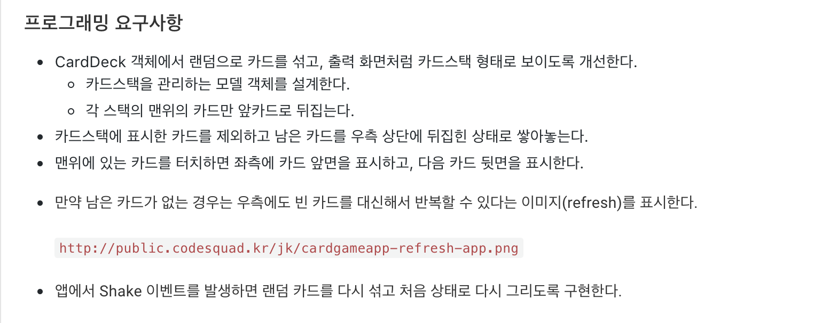

## CardGameApp


### Step1


 이전 단계 포커게임 앱에서 만들었던 것과 거의 동일하게 작성하였다.


**BackGround Pattern 지정해주기**

```swift
class ViewController: UIViewController {
    override func viewDidLoad() {
        self.view.backgroundColor = UIColor.init(patternImage: UIImage(named: "bg_pattern")!)
    }
}
```


**실행화면**


### Step 2



* 이번 단계에서는 `CustomView`를 만들어서 작성하였다.


**UIStackView**

 `UIStackView`란 여러 개의 뷰들을 하나의 세트로 만들어 주는 역할을 해준다. 그렇담 이 세트로 만들어 어떻게 사용하느냐하면 보통 View들을 레이아웃을 잡아줄 때 편리하게 사용할 수 있다. 이 뷰들을 **4가지 Attribute** 들을 사용하여 정렬할 수 있다.

1. Axis : StackView의 정렬할 큰 형태를 정할수 있다. 크게 `.Horizontal` `.Vertical`이 있다.
2. Alignment : StackView안의 view들의 Y축 정렬을 설정할 수 있다.
3. Distribution : StackView안의 view들의 X축 정렬을 설정할 수 있다.
4. Spacing : StackView안의 view들의 간격을 설정할 수 있다.


이번 단계에서는 카드 스택들의 레이아웃을 잡아줄 때 `Custom View` 를 만들어 `UIStackView`를 사용하였다.

```swift
class CardStacksView: UIStackView {
    required init?(coder aDecoder: NSCoder) {
        super.init(coder: aDecoder)
        initialSetting()
    }
    // 스토리보드에 초기화할 때 사용되는 코드
    
    override init(frame: CGRect) {
        super.init(frame: frame)
        initialSetting()
    }
    // 코드로서 초기화할 때 사용되는 코드
    
    private func initialSetting() {
        self.spacing = 5
        self.axis = .horizontal
        self.distribution = .fillEqually
    }
    
    // StackView에 View를 추가할 때
    func addView() {
        self.addArragedSubView(UIview:) // UIView 레퍼런스 타입의 뷰 추가 가능
    }
}

// UIStackView에서는 var arragedSubview :[UIView] 로 뷰들을 관리
```


**실행화면**

1. 초기 화면


2. Deck을 터치하였을 시


3. Deck에 카드가 없을 시


### Step3


* UIGestureRecognizer을 이용하여 더블탭 인식 기능을 구현한다.

* 애니메이션 기능을 구현한다.


**UIGestureRecognizer**

* 7가지 기능

1. Tap Gesture Recognizer
2. Swipe gesture Recognizer
3. Pan Gesture Recognizer
4. Pinch Gesture Recognizer
5. Rotation Gesture Recognizer
6. Screen Gesture Recognizer
7. LongPress Gesture Recognizer


 일반적으로 `UITapGestureRecognizer` 을 추가하기 위해서는 밑의 코드와 같이 해주면 된다.

```swift
class ViewController: UIViewController {
    @IBOutlet var redView: UIView!
    
    override func viewDidLoad() {
		super.viewDidLoad()

		var taps = UITapGestureRecognizer(target: self, action: #selector(handleTapGesture(_:)))
		self.redView.addGestureRecognizer(taps)
	}
}

extension ViewController {
	@objc func handleTapGesture(recognizer: UITapGestureRecognizer) {
		print("Touch RedView")
	}
}
```


 이번 스텝에서는 더블 탭을 구현하고 `CustomView`에  추가해주기 때문에, 조금 다른 방식으로 해주었다. 여기서 `NotificationCenter` 을 활용하였다.

```swift
extension NSNotification.Name {
    static let createdCardView = NSNotification.Name(rawValue: "createdCardView")
}

class CardView: UIImageView {
    func setCardImage(name: String) {
        self.image = UIImage(named: name)
        NotificationCenter.default.post(name: .createdCardView, object: nil, userInfo: ["card" : self])
    }
}

class ViewController {
    override func viewDidLoad() {
        super.viewDidLoad()
    NotificationCenter.default.addObserver(self, selector: 							#selector(addDoubleTapRecognizer(_:)), name: .createdCardView, object: nil)
    }
    
    @objc func addDoubleTapRecognizer(_ notification: NSNotification) {
        let recog = UITapGestureRecognizer(target: self, action: #selector(tapCard(_:)))
        recog.numberOfTapsRequired = 2				// 더블 탭을 인식하기 위한 기능
        
        guard let cardView = notification.userInfo?["card"] as? CardView else { return }
        cardView.addGestureRecognizer(recog)
        cardView.isUserInteractionEnabled = true	// True를 해주어야 인식이 가능
    }
}
```


**애니메이션**

* Animation 가능한 `UIView` 속성
  1. frame, bounds, center : 뷰의 위치와 크기
  2. transform : 좌표 행렬
  3. alpha : 투명도 
  4. backgroundColor : 배경색
  5. contentStretch : 확대 / 축소 영역
* Animation 불가능 속성
  1. hidden 처럼 중간 값이 계산 불가능한 속성


 기본적으로 Animation 기능을 사용하기 위해서 `UIView` 에 구현되어있는 `animate()` 메소드를 사용한다. 여러 인자값을 받는 함수가 있는데 공식문서를 보고 필요에 따라 사용하면 된다.

 애니메이션 실행되면 `animate()` 밑의 코드부분도 역시 실행된다. 애니메이션이 끝날 때까지 기다리지 않는다. 만약 애니메이션이 끝나고 동작하고 싶은 기능이 있으면 `animate()` 메소드 중에 `completion` 을 인자값으로 받는 메소드를 활용하면 된다. `completion` 부분에 넣어준 클로저가 애니메이션이 종료되고 난 후 실행된다.

```swift
// 화면이 서서히 노란색이 되도록 설정
class ViewController: UIViewController {
  @IBOutlet var image: UIView!
  
  override func viewDidLoad() {
    super.viewDidLoad()
    UIView.animate(withDuration: 1.0, animation {
      self.image.backgroundColor = UIColor.yellow
    }, completion: nil)
  }
}
```


```swift
// 화면 사이즈가 커지도록 설정
class ViewController: UIViewController {
  @IBOutlet var image: UIView!
  
  override func viewDidLoad() {
    super.viewDidLoad()
    UIView.animate(withDuration: 1.0, animation {
			self.image.frame.size.width += 10
      self.image.frame.size.height += 10
    }, completion: nil)
  }
}
```


**실행화면** 

1. A카드인 경우 좌측 상단 화면으로 이동


2. 왼쪽 상단에 같은모양 -1이 있는 경우 이동


3. 상단으로 이동할 수 없는 경우, 스택 중에서 좌측부터 앞면으로 된 카드 중 가장 위에 있는 카드와 다음 조건을 확인하고 조건에 맞으면 그 위로 이동

