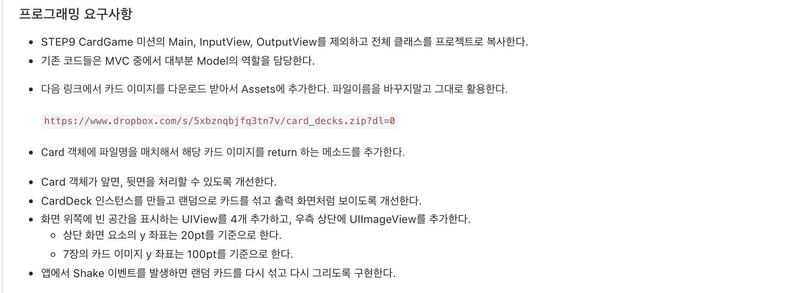

## CardGameApp 정리

### Step 1

* UIStatusBarStyle -> LightContent로 변경하기
* UIView 배경 이미지 패턴으로 변경하기


**StatusBarStyle 변경하기**

 앱 기본설정에서 바꾸는게 가능하고 ViewController내에서 코드로 바꾸는 것이 존재한다.

* 우선 **Info.plist**파일에서 설정을 변경해주어야한다.


1. 앱의 기본 설정에서 바꾸기 위해서는 왼쪽의 프로젝트를 선택하고 다음 그림과 같이 설정을 바꾼다.



2. 코드로 바꾸기 위해서는 ViewController내의 `preferredStatusBarStyle` 프로퍼티를 오버라이드 하여준다.

```swift
class FirstSceen: UIViewController {
    override var preferredStatusBarStyle: UIStatusBarStyle {
            return .lightContent
    }
}
```


**UIView에 이미지 패턴 적용하기**

1. 적용할 이미지를 Asset 폴더에 넣어준다.
2. 뷰의 BackgroundColor에 다음과 같은 코드를 적용하여준다.

```swift
class FirstSceen: UIViewController {
    override func viewDidLoad() {
        self.viewDidLoad()
        self.view.backgroundColor = UIColor.init(patternImage: UIImage(named: "bg_pattern")!) // "bg_pattern"은 Asset에 있는 이미지 파일의 이름이다.
    }
}
```

