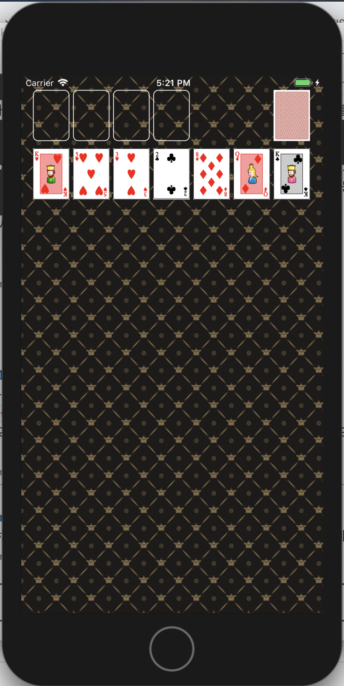

## CardGameApp


### Step1


 이전 단계 포커게임 앱에서 만들었던 것과 거의 동일하게 작성하였다.


**BackGround Pattern 지정해주기**

```swift
class ViewController: UIViewController {
    override func viewDidLoad() {
        self.view.backgroundColor = UIColor.init(patternImage: UIImage(named: "bg_pattern")!)
    }
}
```


**실행화면**




